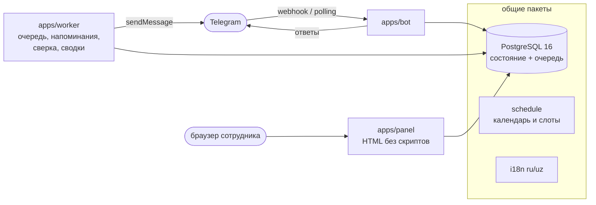
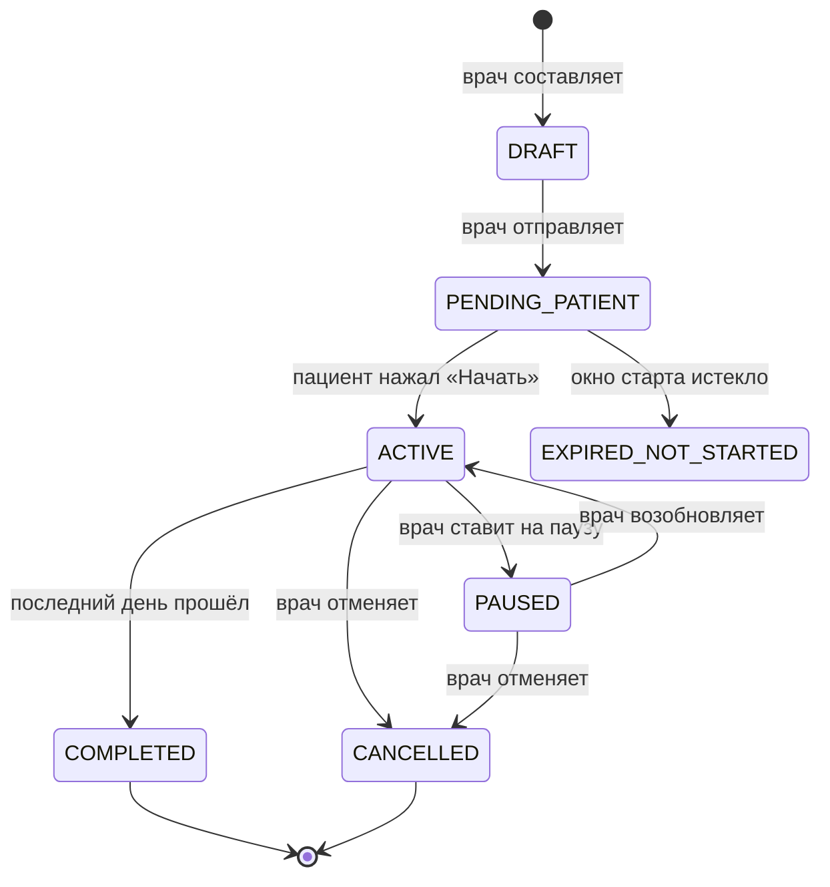

<div align="center">

# 💊 MedCourse

**Telegram-бот контроля курсов лекарств: врач назначает — пациент начинает кнопкой — бот напоминает — врач видит соблюдение.**

_A Telegram bot for medication-course adherence: the doctor writes the course, the patient explicitly starts it, the bot reminds, the doctor sees adherence. MVP for private doctors in Uzbekistan, Russian and Uzbek (Latin)._

[](https://github.com/phant0mcyber01-hud/medcourse/actions/workflows/ci.yml)


[Быстрый старт](#-быстрый-старт) · [Как это работает](#-как-это-работает) · [Документация](#-документация) · [Развёртывание](#-развёртывание-на-сервере) · [Состояние проекта](#-состояние-проекта)

</div>

> ⚠️ **Сервис организует лечение, назначенное врачом.** Он не ставит диагнозы, не выбирает препараты и дозы, не меняет
> схему и не советует менять её самостоятельно. Он не служба экстренной помощи. Об этом сказано пациенту в самом боте.

---

## ✨ Что умеет

| Для кого                 | Что делает                                                                                                                                                                                                                   |
| ------------------------ | ---------------------------------------------------------------------------------------------------------------------------------------------------------------------------------------------------------------------------- |
| 🧑‍⚕️ **Врач**              | Приглашает пациента одноразовой ссылкой · составляет курс мастером в чате · следит за соблюдением · приостанавливает, меняет план, отменяет · получает отчёт файлом (PDF и CSV для Excel)                                    |
| 🙋 **Пациент**           | Соглашается на обработку данных · подтверждает связь с врачом · **сам нажимает «Начать курс»** · получает напоминания · отмечает «Принял / Позже / Пропустил» · видит историю · может отозвать согласие и запросить удаление |
| 👁 **Опекун**             | Только читает расписание и отметки подопечного (после добавления врачом и согласия пациента)                                                                                                                                 |
| 🏥 **Сотрудник клиники** | Веб-панель: врачи своей клиники, курсы без содержимого, операционные инциденты                                                                                                                                               |
| ⚙️ **Администратор**     | **Админка прямо в боте:** заявки врачей → подтвердить с записью «что проверено», отозвать статус, состояние сервиса, инциденты, назначение других администраторов по Telegram id                                             |
| 🛠 **Оператор сервера**   | `ops.cjs`: миграции, зашифрованные копии, репетиция восстановления, проверка готовности установки (`preflight`)                                                                                                              |

### Что делает сервис надёжным

- 🔒 **Напоминаний не будет, пока пациент сам не начал курс.** Повторное нажатие ничего не сбрасывает.
- 🕐 **Время считается по местному времени пациента** (IANA-зона, переход на летнее время учтён), а хранится в UTC.
- 📜 **История не переписывается.** Поздняя отметка не стирает факт пропуска; изменение плана — новая ревизия.
- 📬 **Честная доставка.** Напоминания идут через очередь в базе (outbox): рестарт любого процесса ничего не теряет, а врачу не пишут «пациент уведомлён», пока Telegram этого не подтвердил.
- 🚦 **Под лимитом Telegram:** не больше 25 сообщений в секунду на весь бот, ответ 429 приостанавливает отправку.
- 🧾 **Каждое действие в журнале аудита** — какие поля изменились (но не их значения).

## 🧭 Как это работает



Одна база — единственный источник состояния и очереди: **никаких таймеров в памяти и никакого Redis**. Права проверяются
SQL-предикатами при каждом чтении и записи, а не «на входе».

<details>
<summary><b>Жизненный цикл курса</b></summary>



И приём: `SCHEDULED → NOTIFIED → TAKEN | SKIPPED | MISSED → TAKEN_LATE`, с отложением «Позже» (до трёх раз, не дальше дедлайна).

</details>

## 🚀 Быстрый старт

Нужны **Node 24** и **pnpm 9** (`corepack enable`). Docker не обязателен: тестовый Postgres поднимается встроенный.

```bash
git clone https://github.com/phant0mcyber01-hud/medcourse.git && cd medcourse
pnpm install

cp .env.example .env     # впишите TELEGRAM_BOT_TOKEN тестового бота от @BotFather (в git он не попадёт)
pnpm dev:db              # терминал 1: Postgres 16 на 127.0.0.1:5433
pnpm db:migrate          # терминал 2, один раз
pnpm dev:bot             # бот (polling)
pnpm dev:worker          # терминал 3: напоминания
pnpm dev:panel           # терминал 4: веб-панель, http://localhost:3002 (нужен PANEL_BASE_URL в .env)
```

Откройте бота в Telegram и отправьте `/start`. Чтобы стать администратором (у вас уже должен быть аккаунт в боте):

```bash
pnpm admin grant-admin <ваш-telegram-id>   # id покажет, например, @userinfobot
```

После этого в меню бота появится **⚙️ Админка**: через неё подтверждаются врачи и назначаются другие администраторы.
Врач: «Для врачей» → заявка → подтверждение в админке → «Пригласить пациента» → второй аккаунт Telegram открывает ссылку.

> 🔐 Токен бота лежит **только** в `.env`. Никогда не кладите его в код, в `.env.example`, в чат и в issue.
> Для разработки заведите отдельного тестового бота: настоящие пациенты не должны попадать в ваши опыты.

### Проверки

```bash
pnpm check        # формат + линтер + типы + все тесты — то же, что CI
pnpm test:unit    # быстро, без базы
pnpm test:db      # на настоящем Postgres (поднимается сам)
pnpm build        # собрать dist/*.cjs
```

## 🗂 Структура репозитория

```
apps/
  bot/        Telegram-адаптер: webhook/polling, меню, мастер курса, админка, команды ops и admin
  worker/     очередь напоминаний, оповещения об инцидентах, сверка, сводки, /metrics
  panel/      веб-панель сотрудников (Fastify, HTML на сервере, без клиентских скриптов)
packages/
  config/     переменные окружения → типизированный Config (ошибки называют переменные, не значения)
  db/         схема, 17 миграций, слой доступа (Actors + SQL-предикаты), аудит, шифрование полей, копии
  schedule/   чистые функции календаря: слоты, дедлайны, adherence
  telegram/   клавиатуры, кодек кнопок, тексты напоминаний
  i18n/       русский и узбекский (латиница)
  report/     отчёт по курсу: PDF и CSV
  logger/     pino с вычёркиванием секретов
deploy/       docker-compose.prod.yml, Caddyfile (HTTPS), образец настроек сервера
docs/         ТЗ, архитектура, руководство по пилоту
```

## 📚 Документация

| Документ                                     | Что внутри                                                                                            |
| -------------------------------------------- | ----------------------------------------------------------------------------------------------------- |
| [docs/PILOT.md](docs/PILOT.md)               | **Начните отсюда для запуска:** развёртывание, резервные копии, откат, что утвердить клинике и юристу |
| [docs/ARCHITECTURE.md](docs/ARCHITECTURE.md) | архитектура, модель данных, автоматы состояний, безопасность, решения D-1…D-130                       |
| [docs/TZ.md](docs/TZ.md)                     | исходное техническое задание v1.0                                                                     |
| [PROJECT_STATUS.md](PROJECT_STATUS.md)       | что сделано на каждом этапе, что проверено и чего нет, открытые вопросы                               |
| [CONTEXT.md](CONTEXT.md)                     | договорённости, инварианты кода, грабли среды — для того, кто продолжает работу                       |
| [CONTRIBUTING.md](CONTRIBUTING.md)           | как вносить изменения                                                                                 |
| [SECURITY.md](SECURITY.md)                   | как сообщить об уязвимости                                                                            |

## 🌐 Развёртывание на сервере

Одна команда поднимает базу, миграции, бот, воркер, панель, ежесуточные копии и HTTPS (Caddy):

```bash
docker compose --env-file .env.production -f deploy/docker-compose.prod.yml up -d --build
docker compose --env-file .env.production -f deploy/docker-compose.prod.yml exec backup node ops.cjs preflight --backups /backups
```

`preflight` отвечает на вопрос «можно ли пускать людей»: настройки, Telegram, схема базы, администратор, очередь, свежесть
копии. Подробно, со списком «до пилота обязательно» — в [docs/PILOT.md](docs/PILOT.md).

## 🔐 Безопасность и приватность

- Поля с личными данными (имя пациента, названия препаратов, указания) шифруются **на уровне приложения**; ключи — только в окружении.
- Видимость данных — SQL-предикаты в каждом запросе; врач видит только своих пациентов, пациент — только себя, администратор не видит содержимого курсов.
- Согласие, отзыв согласия, запрос на удаление (обезличивание через 30 дней), показ истории будущему врачу — по решению пациента.
- В логах нет токенов, ключей и текстов назначений; тест на каждом прогоне ищет секреты в файлах репозитория.
- Резервные копии шифруются отдельным ключом (AES-256-GCM); восстановление репетируется командой `drill`.
- Веб-панель: CSP `default-src 'none'`, никаких скриптов, одноразовый вход из бота, CSRF, ограничения частоты запросов.

Уязвимость нашли? См. [SECURITY.md](SECURITY.md).

## 📍 Состояние проекта

| Этапы                                                                                                   |           Статус            |
| ------------------------------------------------------------------------------------------------------- | :-------------------------: |
| 0–3 · ТЗ, архитектура, схема БД и права, ядро расписания                                                |             ✅              |
| 4–7 · Telegram-адаптер, врач и подключение пациента, мастер курса, старт и материализация               |             ✅              |
| 8–10 · воркер и напоминания, пауза/ревизии/отмена, история, adherence, уведомления врачу, опекун        |             ✅              |
| 11–13 · панель клиники и техническая панель, отчёты PDF/CSV, приватность и резервные копии              |             ✅              |
| 14 · пик напоминаний под лимитом Telegram, оповещения об инцидентах, метрики, защита от частых запросов |             ✅              |
| 15 · пилот: команды оператора, проверка готовности, файлы для сервера, руководство                      | ✅ код · людям: утверждения |
| 16 · админка внутри бота: врачи, состояние, инциденты, администраторы                                   |             ✅              |

**Честно о проверенности.** Всё покрыто тестами на настоящем Postgres с поддельным Telegram, и каждый этап проходил
мутационную проверку (намеренные поломки кода, которые тесты обязаны поймать). Живьём проверены сборки, миграции, копии и
восстановление на локальной базе и ответ Telegram на токен. **Ещё не проверено:** полный диалог врача и пациента в настоящем
Telegram, `docker compose up` на сервере, нагрузка тысячами людей, открытие CSV в Excel. Тексты согласия не читал юрист,
узбекские тексты — носитель языка, медицинские — клиника: без этого настоящих пациентов пускать нельзя
(см. [docs/PILOT.md](docs/PILOT.md), раздел 5).

## 🧱 Стек

TypeScript (strict) · Node 24 · pnpm workspaces · Fastify · grammY · PostgreSQL 16 · Drizzle ORM · Zod · pino · Luxon ·
pdf-lib · Vitest · tsup · Docker · Caddy · GitHub Actions

## 🤝 Участие и лицензия

Правила работы — в [CONTRIBUTING.md](CONTRIBUTING.md). Лицензия **пока не выбрана**: код закрытый, все права принадлежат
владельцу проекта, пока он не решит иначе.
