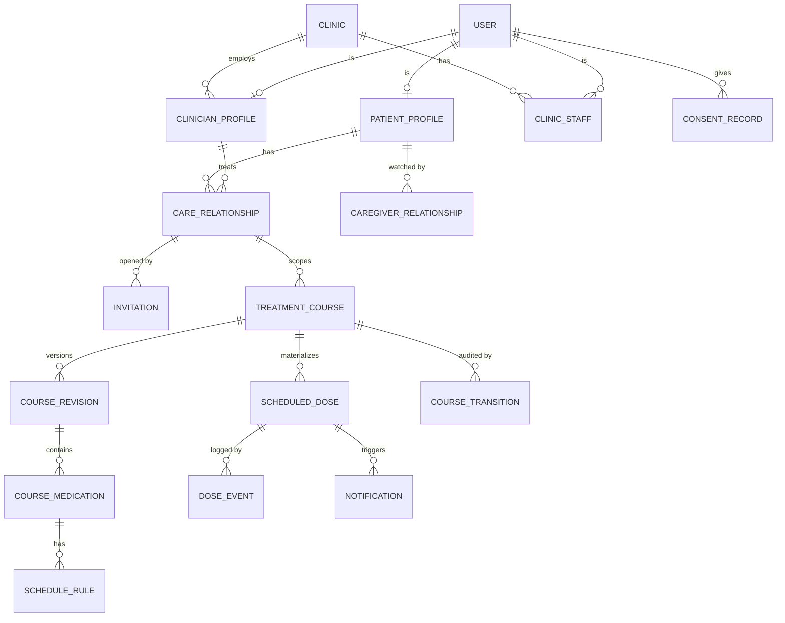

# MedCourse — архитектура MVP

> Проект, а не реализация: кода ещё нет. Основан на [TZ.md](TZ.md) v1.0 (ссылки вида «ТЗ §7»).
> Решения, которых в ТЗ нет или которые в нём противоречат друг другу, собраны в разделе 13 с номерами `D-n`.
> Всё, что помечено «по умолчанию», — моё предложение, ждёт подтверждения владельца.

---

## 1. Принципы

1. **Одно ядро — много интерфейсов** (ТЗ §10). Бот, будущий Mini App и панель клиники вызывают одни и те же use-case'ы из `packages/core`. Типы Telegram в ядро не проникают.
2. **БД — единственный источник состояния и очереди.** Никаких таймеров в памяти процесса, никакого Redis в MVP. Рестарт любого процесса ничего не теряет.
3. **Время хранится в UTC, расписание — в локальном времени пациента** (IANA-зона). Слоты приёмов материализуются заранее в `scheduled_dose`.
4. **История не переписывается.** Действия — append-only события, изменения плана — новые ревизии, поздняя отметка не стирает факт пропуска.
5. **Каждая мутация — одна транзакция:** валидация (Zod) → проверка прав (policy) → допустимость перехода → идемпотентность → запись аудита.
6. **Честная доставка.** Telegram не гарантирует доставку и прочтение; система различает `queued / sent / failed` и никогда не пишет врачу «пациент уведомлён».

## 2. Компоненты

```
Telegram ──webhook──► apps/bot ──┐                       ┌── apps/worker ──► Telegram sendMessage
                                 ├──► packages/core ◄────┤
 браузер ──► apps/panel ─────────┘        │              └── (scheduler, outbox, sweepers)
 (панель сотрудников)                     ▼
                                    packages/db ──► PostgreSQL
```

| Процесс       | Роль                                                                                                                                                                                               |
| ------------- | -------------------------------------------------------------------------------------------------------------------------------------------------------------------------------------------------- |
| `apps/bot`    | HTTP-эндпоинт webhook. Проверяет секрет, дедуплицирует `update_id`, превращает update в вызов use-case, отвечает пользователю. Тяжёлой работы не делает.                                           |
| `apps/worker` | Цикл: отправка из outbox, sweeper пропусков, истечение окон старта, завершение курсов, ежедневная сверка, сборка сводок. Масштабируется горизонтально (`FOR UPDATE SKIP LOCKED`).                  |
| `apps/panel`  | Панель для сотрудников: страницы HTML, собранные на сервере (Fastify), без клиентских скриптов. Вход одноразовой ссылкой из бота. Свои роли: технический администратор и сотрудники клиники (9.1). |

Раскладка репозитория (pnpm workspaces):

```
apps/        bot · worker · panel
packages/    config (env → типизированный Config)   logger (pino + redaction)
             db (клиент, схема, миграции)           core (домен, use-cases, policy)
             schedule (чистые функции календаря)    i18n (ru/uz, plural)
             telegram (клавиатуры, рендер, callback-кодек)   report (отчёт по курсу: CSV и PDF)
docs/        TZ.md · ARCHITECTURE.md
```

Построено на этапах 1–4: `config`, `logger`, `db` (клиент, схема, миграции, слой доступа, аудит, шифрование полей, репозитории), `schedule` (расписание: чистые функции без БД и Telegram), `i18n` (RU/UZ), `bot` (Telegram-слой и онбординг), `worker` (пока только уборка). Остальное появляется на своих этапах.

**Слой доступа живёт в `packages/db`, а не в `core`.** Видимость данных — это SQL-предикаты (`access/scopes.ts`), которые репозитории добавляют в `WHERE` каждого чтения: данные не могут вернуться без пути от актора к ним. Правила переходов состояний и «кто что имеет право менять» — в `core` (этап 3+), и они пользуются репозиториями. Так `core` зависит от `db`, а не наоборот.

**Внутренние пакеты поставляются исходниками** (`exports` → `src/index.ts`), без отдельной сборки: tsx, vitest и tsc читают их напрямую, а каждое приложение собирается tsup в **один самодостаточный файл** `dist/main.cjs`. В образе нет `node_modules`.

**Окружение читается в одном месте** — `packages/config` (`loadConfig` валидирует Zod-схемой, пустое значение = не задано, ошибки называют переменные, но не их значения). Правило ESLint запрещает `process.env` везде, кроме этого пакета.

`packages/schedule` не знает ни про БД, ни про Telegram: на вход — правила и зона, на выход — список слотов. Именно он покрывается самыми строгими unit-тестами.

## 3. Стек

**D-1 решён 2026-10-02: TypeScript** (ТЗ §16). Версии зафиксированы лок-файлом; TypeScript закреплён на 6.0.x, потому что typescript-eslint пока не поддерживает 7.x.

| Слой      | Выбор                                                                 | Примечание                                         |
| --------- | --------------------------------------------------------------------- | -------------------------------------------------- |
| Язык      | TypeScript (strict), Node 24, pnpm 9                                  | монорепо pnpm workspaces                           |
| Telegram  | grammY, webhook-режим                                                 | проверить актуальную версию при старте этапа 4     |
| БД        | PostgreSQL 16 + Drizzle ORM                                           | запросы — Drizzle; миграции — SQL up/down, см. 4.5 |
| Валидация | Zod на всех границах                                                  | env, callback, ввод врача, use-case input          |
| Время     | Luxon (IANA-зоны)                                                     | не фиксированное смещение UTC (ТЗ §13)             |
| Очередь   | таблица `notification` как transactional outbox                       | отдельный брокер — только при доказанной нужности  |
| Панель    | серверный HTML на Fastify, без клиентского JS                         | D-84; Next.js — если понадобится в V2              |
| Логи      | pino со списком redaction                                             | JSON в stdout                                      |
| Отчёты    | CSV вручную; PDF — pdf-lib + fontkit, шрифт DejaVu Sans встроен в код | этап 12, D-100                                     |
| Деплой    | Docker Compose: local → staging → VPS                                 | отдельные бот-токены и БД по окружениям            |

## 4. Модель данных

Полный список полей — в ТЗ §9. Здесь только **отличия и добавления**, без которых схема не выдерживает сценарии ТЗ.

Имена таблиц в БД — во множественном числе, snake_case: `treatment_courses`, `scheduled_doses`; ниже и на диаграмме — понятия. **Создано на этапе 2:** `clinics`, `users`, `patient_profiles`, `clinician_profiles`, `clinic_staff`, `platform_staff`, `care_relationships`, `caregiver_relationships`, `treatment_courses`, `course_revisions`, `course_medications`, `schedule_rules`, `reminder_policies`, `course_transitions`, `scheduled_doses`, `dose_events`, `audit_log`. **Этап 4:** `tg_updates`, `conversation_states`, `consent_records`, колонка `users.timezone_confirmed_at`. **Этап 9:** `course_pauses`. **Этап 10:** `doctor_alerts`, `caregiver_invitations`. **Этап 11:** `panel_logins`, `panel_sessions`, `incidents`. **Этап 12:** `course_exports` (вместо задуманного `export_job`: файл строится сразу, статусов у выдачи нет). **Этап 13:** `deletion_requests`, `course_summaries`, колонка `care_relationships.history_shared_at`.



### 4.1 Отличия от ТЗ §9

| Что                               | Решение                                                                                                                                                                                                                                                                                                                                                                                                     | Почему                                                                                                   |
| --------------------------------- | ----------------------------------------------------------------------------------------------------------------------------------------------------------------------------------------------------------------------------------------------------------------------------------------------------------------------------------------------------------------------------------------------------------- | -------------------------------------------------------------------------------------------------------- |
| `User.role`                       | Убрано. Роль выводится из наличия `patient_profile`, `clinician_profile`, `clinic_staff(role)`.                                                                                                                                                                                                                                                                                                             | Врач может сам быть пациентом; одна колонка роли это запрещает.                                          |
| Версии плана                      | Таблица `course_revision` (`rev_no`, `status`: DRAFT/CONFIRMED/APPLIED/SUPERSEDED, кто и когда подтвердил). `course_medication` и `schedule_rule` принадлежат ревизии и после подтверждения **неизменяемы**. `treatment_course.current_revision_id`.                                                                                                                                                        | ТЗ §8.3: изменение плана создаёт версию, прошлое не пересчитывается. Прошлый план сохраняется сам собой. |
| Стабильная идентичность препарата | `course_medication.line_id` — одинаков во всех ревизиях.                                                                                                                                                                                                                                                                                                                                                    | Чтобы уникальность слота работала сквозь ревизии.                                                        |
| `scheduled_dose`                  | + `revision_id`, `deadline_at`, `missed_at`, `late_taken_at`; статусы + `SUPERSEDED`, `TAKEN_LATE`. Частичный уникальный индекс `(course_id, line_id, scheduled_at) WHERE status <> 'SUPERSEDED'`.                                                                                                                                                                                                          | Инвариант «два активных приёма на один слот невозможны» (ТЗ §8.3).                                       |
| `dose_event`                      | Append-only; типы `NOTIFIED, SNOOZED, TAKEN, SKIPPED, MISSED, LATE_TAKEN, CORRECTION, SUPERSEDED`. `scheduled_dose.status` — денормализованный результат, пересчитываемый из событий. Для PRN `scheduled_dose_id` может быть NULL (+ `medication_line_id`).                                                                                                                                                 | ТЗ §8.2 сам рекомендует append-only. PRN не имеет планового слота (D-12).                                |
| Идемпотентность                   | `UNIQUE(idempotency_key)` в `dose_event`; для callback ключ = `callback_query.id`. Уникальность терминальных событий (`TAKEN`, `SKIPPED`) «среди неисправленных» отложена до этапа 8: она зависит от модели исправлений.                                                                                                                                                                                    | Повторное нажатие — не вторая запись.                                                                    |
| `tg_update`                       | `update_id bigint PK, received_at`; чистится по cron старше 7 суток.                                                                                                                                                                                                                                                                                                                                        | Telegram повторяет webhook при сбое — дедупликация на входе.                                             |
| `conversation_state`              | `user_id, flow, step, data jsonb, expires_at`.                                                                                                                                                                                                                                                                                                                                                              | Мастер создания курса переживает рестарт; состояние диалога не живёт в памяти.                           |
| `invitation`                      | `clinician_id`, `code_hash` (sha-256 hex, уникален), `label` (пометка врача, пациент её не видит), `expires_at`, `used_at/used_by/care_relationship_id` (все три или ни одного; составной FK к `care_relationship(id, patient_id, clinician_id)` — связь обязана быть именно между этим врачом и этим пациентом), `revoked_at`. Использован и отозван одновременно быть не может. Сам код в БД не хранится. | ТЗ §17.1 + защита от перебора (ТЗ §18).                                                                  |
| `invitation_attempt`              | `telegram_user_id`, `at`: только неудачные попытки, без введённого кода; окно 1 час, чистится воркером.                                                                                                                                                                                                                                                                                                     | ТЗ §18.                                                                                                  |
| `notification`                    | Outbox: `course_id`, `scheduled_dose_id` (составной FK: приём того же курса), `recipient_user_id`, `kind` (`DOSE_REMINDER`, `DOSE_LEAD`), `attempt_no`, `due_at`, `status` (QUEUED/SENDING/SENT/FAILED/CANCELLED), `locked_until` (только при SENDING), `sent_at` (только при SENT), `UNIQUE(scheduled_dose_id, kind, attempt_no)`. Ревизия берётся через приём.                                            | Создаётся целиком в момент старта (этап 7); отправка — этап 8.                                           |
| `course_transition`               | Журнал переходов состояния курса: `from, to, actor, reason, at`.                                                                                                                                                                                                                                                                                                                                            | ТЗ §8.1: актор, время, причина каждого перехода.                                                         |
| `doctor_alert`                    | Очередь событий для врача (MISS, SERIES, DELIVERY_FAILED) с полем агрегации.                                                                                                                                                                                                                                                                                                                                | Агрегация без потока сообщений (ТЗ §4.1).                                                                |
| `incident`                        | = `AdminIncident` из ТЗ + `kind` (OPERATIONAL / TECHNICAL), `resolution_note`.                                                                                                                                                                                                                                                                                                                              | Раздельные потоки для клиники и разработчиков (ТЗ §3.2, §16.1).                                          |
| `deletion_request`, `export_job`  | Статус, кто, когда, итог.                                                                                                                                                                                                                                                                                                                                                                                   | Аудит удаления и экспорта (ТЗ §12, §14.3).                                                               |

### 4.2 Что шифруется

Прикладное шифрование AES-256-GCM, ключи из окружения/secret manager, `key_id` в каждой записи (ротация без перешифровки всего). Шифруются: `phone`, `date_of_birth`, `dose_event.reason_text`, `course_medication.instructions` (свободный текст врача). `telegram_user_id` — открытый (нужен для поиска), доступ только через репозиторий.

### 4.3 Ключевые индексы

Из ТЗ §9.2 без изменений, плюс:
`scheduled_dose(status, deadline_at)` — для sweeper пропусков;
`notification(status, due_at) WHERE status = 'QUEUED'` — для выборки outbox;
`care_relationship(clinician_id, patient_id) WHERE status = 'ACTIVE'` — уникальна;
`invitation(code_hash)` — уникален.

### 4.4 Что БД гарантирует сама (этап 2)

Эти правила держатся ограничениями и триггерами, а не кодом приложения; каждое покрыто тестом в `constraints.db.test.ts`.

- **Курс нельзя привязать к чужим людям.** Составной внешний ключ `(care_relationship_id, patient_id, clinician_id)` ссылается на связь врач–пациент, а `(clinician_id, clinic_id)` — на профиль врача: пациент, врач и клиника курса обязаны совпадать со связью и друг с другом.
- **Всё внутри одного курса.** Приём ссылается на ревизию, препарат, правило и линию препарата составными ключами; событие — на приём и курс. «Чужую» ревизию или правило вписать нельзя. `current_revision_id` обязан быть ревизией этого же курса.
- **Подтверждённый план неизменяем.** Триггеры отказывают на INSERT/UPDATE/DELETE препаратов и правил, если ревизия не `DRAFT`; ревизия ходит только вперёд (`DRAFT → CONFIRMED → APPLIED → SUPERSEDED`), подтверждённую нельзя удалить; `APPLIED` не больше одной на курс.
- **PRN.** Без обоих лимитов не существует; расписания у него быть не может (и препарат с правилами нельзя сделать PRN).
- **Состояние курса согласовано.** `ACTIVE/PAUSED/COMPLETED` ⇒ есть `start_at`; `DRAFT/PENDING_PATIENT/EXPIRED_NOT_STARTED` ⇒ его нет; `start_at` и `effective_start_date` задаются парой; финальные статусы требуют `ended_at`.
- **Время приёма согласовано со статусом.** `finalized_at`, `missed_at`, `late_taken_at` присутствуют ровно тогда, когда статус их подразумевает; дедлайн позже слота; два живых слота одного препарата на один момент невозможны.
- **Политика напоминаний.** `miss_after_minutes > (attempts − 1) × retry_interval_minutes`: дедлайн всегда после последней попытки.
- **Журналы только дописываются.** `audit_log`, `course_transitions`, `dose_events` отказывают на UPDATE, DELETE и TRUNCATE для любой роли (триггеры; в production права на изменение дополнительно отзываются у роли приложения, этап 14). Запись аудита не имеет внешнего ключа на пользователя: след переживает удаление.
- **События.** Один `idempotency_key` на событие; причина только у `SKIPPED`, свободный текст только при причине `OTHER`; `SYSTEM` ⇔ нет пользователя ⇔ источник `SYSTEM`.

### 4.5 Миграции и доступ к БД

- **SQL up/down + свой раннер** (`packages/db/src/migrate.ts`). `drizzle-kit` не используется: он не умеет откат, а ТЗ требует проверять миграции вверх и вниз. Каждая миграция — пара `NNNN_name.up.sql` / `.down.sql`, применяется в своей транзакции под advisory lock; применённые обязаны быть префиксом списка файлов с теми же контрольными суммами. В production только вперёд (CLI отказывает в `down`).
- **Drizzle описывает таблицы для типизированных запросов, SQL — источник истины.** `schema.db.test.ts` падает, если колонки, типы, nullability, индексы или списки enum-значений разошлись.
- **Два клиента postgres.js.** `drizzle()` подменяет сериализаторы времени и JSON на клиенте, который ему передали: `Date`-параметр в обычном запросе перестаёт биндиться, а даты приходят строками. Поэтому `Database.sql` (сырые запросы, миграции) и `Database.orm` (Drizzle) живут на разных клиентах с разными пулами.
- **Тесты на настоящем Postgres.** Один сервер на прогон (`DATABASE_URL`, если задан, иначе встроенный Postgres 16 из `embedded-postgres`) и отдельная БД с миграциями на каждый тестовый файл.

## 5. Календарь и расписание

### 5.1 День курса (ТЗ §7.1)

```
effective_start_date = локальная дата нажатия «Начать» в зоне пациента
day_no(now)          = localDate(now, tz) − effective_start_date + 1
last_day             = effective_start_date + duration_days − 1
```

Нажатие в 23:50 даёт день 2 уже в 00:00 — первый день короткий. Поэтому старт — **двухшаговый** (D-7): карточка → «▶️ Начать курс» → экран «Начать сейчас? Сегодня осталось N приёмов» → «Да, начать». Повторное нажатие в любой момент — no-op с ответом «Курс уже начат».

Реализовано в `packages/schedule` (`courseDayAt`, `previewStart`). Экран второго шага строится той же генерацией слотов, что и настоящий старт, поэтому «осталось N приёмов» не может разойтись с тем, что произойдёт. Окно старта проверяет `startWindowState` (обе границы включительно, как `BETWEEN` в запросе старта).

### 5.2 Старт и материализация

`startCourse` выполняется одной транзакцией:

1. `UPDATE treatment_course SET status='ACTIVE', start_at=now(), effective_start_date=… WHERE id=$1 AND status='PENDING_PATIENT' AND now() BETWEEN start_window_from AND start_window_to RETURNING …`. Ноль строк — курс уже стартовал / вне окна / не тот статус; повторного старта нет по построению.
2. Для каждого препарата и правила текущей ревизии `packages/schedule` строит слоты: каждый день диапазона `active_from_day..active_to_day` × `local_time` → UTC через зону. Слоты с `scheduled_at <= start_at` **не создаются** (D-8) и в adherence не входят.
3. Вставка `scheduled_dose` (`ON CONFLICT DO NOTHING` по частичному индексу) и `notification` для всех попыток, `due_at` уже посчитан.
4. Запись `course_transition` + `audit_log`. Уведомление врачу «курс начат».

Курс ограничен `duration_days ≤ 365` и числом слотов ≤ лимита — материализация целиком, без «скользящего окна»: проще рассуждать и сверять.

`generateSlots` детерминирован (сортировка по времени, препарату, правилу), отказывает на двух слотах одного препарата в один момент (`DUPLICATE_SLOT`, база отказала бы тоже) и на превышении лимита (`TOO_MANY_SLOTS`, по умолчанию 20 000). Граница `scheduled_at > start_at` строгая: слот ровно в момент нажатия не создаётся. `validatePlan` возвращает **все** проблемы плана разом, кодами для локализации; его структурные правила совпадают с CHECK-ограничениями БД (проверено тестом против настоящего Postgres), а несколько правил строже базы (время «8:00», препарат длиннее курса, правило вне диапазона препарата, препарат без расписания), потому что база не знает курса.

**Как это сделано (этап 7, `repositories/runs.ts`).** Одна функция `assess` решает, можно ли начать курс сейчас и что из этого выйдет; ею пользуются и первый экран («начать сейчас?»), и сама транзакция старта, поэтому показанное пациенту и сделанное не расходятся. Отказы различимы: уже начат, вне окна, врач недоступен (D-46: верификация, статус практики и связь проверяются в момент старта), «не останется ни одного приёма» (D-47), недоступен. Шаг, который делает старт необратимым, — условный `UPDATE` с проверкой статуса и окна; транзакция, не получившая строку, заново оценивает ситуацию и отвечает «уже начат». Приёмы и напоминания вставляются пачками по 500 строк с заранее выданными id. День 1 — локальная дата нажатия в поясе курса. Курс только из препаратов «по необходимости» начинается без приёмов.

**Проверка гонок.** Тест «N одновременных вызовов» сам по себе не доказывает защиту: при прогретом пуле соединений вызовы могут не пересечься, и тест пройдёт даже без неё (это показала мутационная проверка). Поэтому гонка воспроизводится принудительно: отдельное соединение держит `FOR UPDATE` на строке, тест ждёт, пока все участники появятся в `pg_stat_activity` с ожиданием блокировки, и отпускает их разом.

### 5.3 Политика напоминаний (по умолчанию, D-9)

| Параметр                    | Значение                                                                                                                   |
| --------------------------- | -------------------------------------------------------------------------------------------------------------------------- |
| Попыток                     | 3: в момент слота, +10 мин, +20 мин                                                                                        |
| Дедлайн (`deadline_at`)     | `scheduled_at + 30 мин` — после него `MISSED`                                                                              |
| «Позже»                     | 5 / 10 / 15 мин; не позже `deadline_at − 1 мин`; максимум 3 раза на приём                                                  |
| Окно исправления            | 60 мин для пациента; врач исправляет в любое время с аудитом                                                               |
| Предварительное напоминание | выключено (отдельная настройка)                                                                                            |
| Ночные слоты                | отправляются, если врач включил их; настройка пациента не может молча их подавить — конфликт показывается обоим (ТЗ §7.10) |

Параметры лежат в `reminder_policy`, правятся врачом на курс. 2 минуты из ответов к ТЗ допустимы только как явный режим тестового пилота.

Значения по умолчанию и ограничения политики в `packages/schedule` проверены против колонок и CHECK-ограничений `reminder_policies` (контрактный тест на Postgres). **«Позже» не обрезается молча:** `availableSnoozeOptions` предлагает только те варианты, что укладываются до `deadline_at − 1 мин`, и ни одного после лимита; `snoozeUntil` на недоступный вариант отвечает ошибкой.

### 5.4 Изменение плана (ТЗ §17.4)

Новая ревизия → врач подтверждает → пациент подтверждает → применение: все открытые `scheduled_dose` прежней ревизии → `SUPERSEDED`, их `notification` → `CANCELLED`, новые слоты материализуются с `scheduled_at > now`. Прошедшие приёмы не трогаются. Любой job перед отправкой сверяет `revision_id` с текущим — устаревший завершается без отправки.

**Как это сделано (этап 9, `repositories/changes.ts`).** План в силе не редактируется никогда. `open` создаёт рядом ревизию `DRAFT` с копией препаратов (те же `line_id`: нетронутый препарат остаётся той же строкой курса); врач добавляет и убирает препараты тем же мастером (`plans.addMedication/removeMedication` работают с «планом, который ещё пишется»: черновиком курса или неотправленным изменением). `send` проверяет план теми же правилами, что и первую отправку, отказывает, если ничего не изменилось, и делает ревизию `CONFIRMED`; с этого момента её видит пациент. `accept` (пациент) в одной транзакции под блокировкой строки курса: прежняя ревизия → `SUPERSEDED`, новая → `APPLIED`, `current_revision_id` переключается, открытые приёмы снимаются срезом (ниже), новый план раскладывается на будущее с учётом пауз. На паузе раскладки нет: её сделает возобновление уже по новому плану. `drop` (врач): черновик удаляется, отправленное предложение становится `SUPERSEDED`, не вступив в силу. На курс — не больше одной ревизии «в работе» (уникальный индекс). Менять можно состав препаратов; длительность курса принадлежит курсу, а не ревизии, и в идущем курсе не меняется (D-66).

**Срез (`planRetire`, D-62).** Пауза, отмена и смена плана делают с расписанием одно и то же: приём с исходом — история, не трогается; открытый приём, чей дедлайн уже прошёл, — пропуск с моментом дедлайна (как записал бы sweeper); любой другой открытый приём, **включая тот, по которому напоминание уже идёт**, — `SUPERSEDED` и в соблюдение не входит. Все ожидающие напоминания курса отменяются, в том числе `SENDING`. Правило этапа 3 («приём в момент „сейчас“ принадлежит старому плану») заменено: напоминание по плану, который врач только что остановил или заменил, хуже, чем один незасчитанный приём.

### 5.5 Пауза и конец курса (D-10)

Пауза делает открытые слоты `SUPERSEDED` (срез выше). `duration_days` считается по дням приёма, а не по календарю: возобновление раскладывает действующий план заново строго после своего момента, и конец курса сдвигается на число целых дней паузы. Новой ревизии возобновление не создаёт: план не менялся (D-63); новую дату окончания врач видит в ответе, пациент — в сообщении. Курс завершается (`COMPLETED`), когда все слоты финализированы и `last_day` прошёл.

Интервалы пауз хранятся в `course_pauses` (D-61): `paused_at`, `resumed_at` (пусто, пока пауза открыта), кто поставил и кто снял. Открытая пауза на курс одна; строка закрывается один раз, не удаляется и не двигается (триггер).

Реализация (`CourseTimeline`): **день, целиком лежащий внутри паузы, не считается; день, покрытый паузой частично, считается.** Поэтому пауза на сутки, выровненная по локальной полуночи, сдвигает конец курса на день, а пауза «с 08:00 до 08:00» не сдвигает ничего: приёмы внутри неё пропадают и не компенсируются (см. D-20). Открытая пауза (`to = null`) оставляет конец курса неизвестным (`lastCourseDay` = `null`). Сутки измеряются по часам зоны: при переходе на летнее время они длятся 23 или 25 часов. Функции принимают интервалы как данные; хранит их `course_pauses`.

### 5.6 Правила времени, зафиксированные в коде

- **Только именованные зоны IANA.** Смещение вида `+05:00` отклоняется, хотя среда его принимает: смещение ничего не знает о переходе на летнее время и истории зоны (§13). Регистр нормализуется (`asia/tashkent` → `Asia/Tashkent`).
- **Время, которого нет** (часы перескочили через него): сдвигается вперёд на длину скачка, 02:30 в день перехода 02:00→03:00 — это 03:30. Приём не теряется.
- **Время, которое бывает дважды** (часы переведены назад): берётся первое вхождение. Напоминание не срабатывает дважды.
- **Границы.** Ответ ровно в `deadline_at` уже «поздний» (с этого момента доза `MISSED`); ответ ровно за 60 минут до слота ещё «вовремя», на миллисекунду раньше — «слишком рано». Окно паузы включает начало и исключает конец.
- **Момент пропуска.** `missed_at` равен `deadline_at`, а не времени работы sweeper'а: результат не зависит от того, когда тот отработал.
- **Тихие часы пациента** (`isInQuietHours`, `quietHoursConflicts`) могут пересекать полночь; окно с равными концами пусто, а не «круглые сутки». Назначенный врачом ночной приём не подавляется молча — конфликт возвращается и показывается обеим сторонам (ТЗ §7.10).
- **Смена плана, пауза, отмена** (`planRetire`, `planRevisionSwitch`, `planPause`): один срез на все три (5.4). Граница у открытого приёма — его дедлайн: ровно в `deadline_at` это уже пропуск. Новый план раскладывается с условием `scheduled_at > now`: прошлое задним числом не заполняется, а слот, совпавший со снятым, создаётся заново (освободившийся слот свободен).
- **Соблюдение расписания** (`summarizeAdherence`): формула из §11 печатается в отчёте константой `ADHERENCE_FORMULA`; без наступивших приёмов процента нет (`null`), а не 0% и не 100%.

## 6. Автоматы состояний

### 6.1 Курс

Упрощение ТЗ §8.1: `SCHEDULED`/`READY_TO_START` убраны (D-6) — «ознакомление» это шаг двухшагового старта, а не состояние.

| Из                                  | Команда (актор)                            | В                     | Условия и эффекты                                                                                                                         |
| ----------------------------------- | ------------------------------------------ | --------------------- | ----------------------------------------------------------------------------------------------------------------------------------------- |
| —                                   | `createCourseDraft` (врач)                 | `DRAFT`               | связь врач–пациент `ACTIVE`, врач верифицирован                                                                                           |
| `DRAFT`                             | `sendCourseToPatient` (врач)               | `PENDING_PATIENT`     | ревизия подтверждена врачом, валидация пройдена (PRN с лимитами, дозы, время); карточка уходит пациенту; **напоминаний нет**              |
| `DRAFT`                             | `discard` (врач)                           | `CANCELLED`           | черновик выброшен до отправки: `cancellation_reason_code = DRAFT_DISCARDED`, пациент о нём не узнаёт; история переходов сохраняется       |
| `PENDING_PATIENT`                   | `cancel` (врач)                            | `CANCELLED`           | отзыв до старта (`WITHDRAWN_BEFORE_START`, D-65): начать уже нельзя; исправление — новый курс с копией отозванного                        |
| `PENDING_PATIENT`                   | `startCourse` (пациент)                    | `ACTIVE`              | см. 5.2; вне окна — отказ + контакт врача (D-5)                                                                                           |
| `PENDING_PATIENT`                   | sweeper                                    | `EXPIRED_NOT_STARTED` | окно старта истекло; врачу уведомление                                                                                                    |
| `ACTIVE`                            | `pause` (врач; пациент — только запрос)    | `PAUSED`              | срез 5.4; интервал в `course_pauses`; пациенту сообщение; запрос пациента создаёт `doctor_alert` (этап 10), сам не паузит                 |
| `PAUSED`                            | `resume` (врач)                            | `ACTIVE`              | пауза закрывается, действующий план раскладывается на будущее с учётом пауз (5.5); новой ревизии нет (D-63)                               |
| `ACTIVE`/`PAUSED`                   | `cancel` (врач)                            | `CANCELLED`           | **напоминания блокируются сразу** (D-11): срез 5.4; `CANCELLED_BY_DOCTOR`; пациенту сообщение. Частная практика — без рассмотрения (D-64) |
| `ACTIVE`/`PAUSED`/`PENDING_PATIENT` | `requestCourseCancellation` (врач клиники) | `CANCELLATION_REVIEW` | для клиник с администратором (этап 11); в MVP частных врачей не используется                                                              |
| `CANCELLATION_REVIEW`               | `resolveCancellation` (админ клиники)      | `CANCELLED`           | запись решения                                                                                                                            |
| `ACTIVE`                            | sweeper (`completeDue`)                    | `COMPLETED`           | последний день (с паузами) прошёл и у каждого приёма есть исход; пациенту одно сообщение                                                  |
| финальные                           | retention job                              | `ARCHIVED`            | по утверждённой политике хранения                                                                                                         |

Любой недопустимый переход — безопасный машинный код ошибки, состояние не меняется.

**Как это сделано (этап 9, `repositories/lifecycle.ts`).** `pause`, `resume`, `cancel` и `completeDue` первым делом берут строку курса под `FOR UPDATE`; то же делают принятие и отзыв изменения плана. Ответ пациента берёт ту же строку под `FOR SHARE`. Поэтому любые два действия над одним курсом, пришедшие одновременно, выполняются по очереди, и второе видит результат первого: двойное нажатие даёт один переход, ответ пациента либо успевает до паузы и сохраняется, либо приходит после и находит приём снятым. Старт пациента — условный `UPDATE` по статусу — стоит в той же очереди.

### 6.2 Приём

| Из                               | Событие                        | В            | Условия                                                              |
| -------------------------------- | ------------------------------ | ------------ | -------------------------------------------------------------------- |
| `SCHEDULED`                      | отправлена попытка 1           | `NOTIFIED`   | курс `ACTIVE`, `revision_id` актуален                                |
| `NOTIFIED`                       | «Позже»                        | `SNOOZED`    | лимит 3, не за `deadline_at`                                         |
| `SNOOZED`                        | сработал таймер                | `NOTIFIED`   |                                                                      |
| `SCHEDULED`/`NOTIFIED`/`SNOOZED` | «Принял»                       | `TAKEN`      | `now < deadline_at`; из «Сегодня» — не раньше чем за 60 мин до слота |
| те же                            | «Пропустить» + причина         | `SKIPPED`    |                                                                      |
| те же                            | sweeper, `deadline_at` прошёл  | `MISSED`     | `doctor_alert`: MISS                                                 |
| `MISSED`                         | «Принял» после дедлайна        | `TAKEN_LATE` | `missed_at` сохраняется                                              |
| `TAKEN`/`SKIPPED`/`TAKEN_LATE`   | `correctDoseEvent`             | пересчёт     | в окне исправления; исходное событие остаётся в журнале              |
| любое нефинальное                | смена ревизии / пауза / отмена | `SUPERSEDED` | не входит в adherence                                                |

## 7. Telegram-слой

**Два режима получения апдейтов.** _Webhook_ (все окружения, кроме local): HTTPS, `POST /telegram/<сегмент>`, где сегмент выводится из секрета (HMAC), так что настраивать нечего и адрес не угадать. Заголовок `X-Telegram-Bot-Api-Secret-Token` сверяется за постоянное время **до разбора тела**: неавторизованный запрос ничего не стоит и получает 403. _Polling_ (только `APP_ENV=local`): бот сам спрашивает Telegram (`getUpdates`), публичный адрес не нужен; при старте снимает webhook, ошибки ретраит с нарастающей паузой, «ядовитый» апдейт не останавливает цикл. Тело апдейта в логи не пишется (только `update_id` и ошибка).

**Порядок обработки и гарантии.** (1) ограничитель частоты (20 апдейтов за 10 с на человека, в памяти; лишнее молча отбрасывается) → (2) **claim**: вставка `update_id` в `tg_updates`, конфликт = повтор, ничего не делаем → (3) вся работа с БД в одной транзакции → (4) только после коммита ответы в Telegram. Апдейт заявляется _до_ обработки, поэтому обрабатывается **не более одного раза**: Telegram повторяет всё, что не подтверждено вовремя, а двойное нажатие кнопки хуже потерянного, которое человек просто повторит. На напоминания это не распространяется: у них будет outbox (этап 8). Сбой обработки → извинение на двух языках и 200 в webhook (код ошибки только вызвал бы повтор). Сбой одного ответа не мешает остальным; «message is not modified» — норма.

**Что бот слышит.** Только личные чаты с человеком: группы, другие боты, `edited_message` и всё, кроме сообщений и нажатий кнопок, игнорируются. Заблокированный (`BLOCKED`/`DELETED`) пользователь не получает ничего и не может зарегистрироваться заново. Ответы без `parse_mode`: введённое человеком не может сойти за разметку.

**Онбординг пациента** (`handler.ts`, чистая функция «апдейт + репозитории → список ответов», без зависимости от grammY): язык (двуязычный запрос) → согласие (версия текста `CONSENT_VERSION`) → имя → фамилия → часовой пояс (предлагается Ташкент; «другой» — шесть городов, зона берётся из списка в коде, а не из кнопки) → меню. Состояние шага хранится в `conversation_states` (ключ — Telegram id, TTL 24 ч, продлевается каждым шагом), не в памяти процесса. **Учётная запись создаётся в момент согласия**, не раньше: до него есть только запись диалога с Telegram id и выбранным языком, которая истекает. Отказ от согласия не оставляет ни аккаунта, ни согласия. Согласие — append-only (`consent_records`: версия текста, язык, контекст), повтор той же версии не создаёт строку, одновременные нажатия сериализуются advisory lock. Имя проходит `cleanName`: буквы любого алфавита, эмодзи и апострофы допустимы, управляющие символы и **символы смены направления текста** (которыми одно имя выдают за другое) — нет. Раздел «Мой курс/Сегодня/История» пока отвечает «курсов нет».

**Бот не может написать первым (критично).** Поиск пациента «по Telegram ID/имени» из ТЗ §5.1 технически невозможен: пока человек сам не нажал Start, бот не может ему написать. Поэтому подключение — **только по deep-link** `t.me/<bot>?start=i_<код>`. Врач получает ссылку (и QR) и передаёт её любым каналом.

**Приглашение.** 16 случайных байт → base64url (22 символа); в базе только sha-256 (`invitations.code_hash`), код нигде больше не хранится: пока новый человек проходит регистрацию, в диалоге лежит лишь хэш. TTL 72 ч, одноразовый, не больше 20 неиспользованных у врача. Для врача только тот, у кого профиль `VERIFIED`, клиника `ACTIVE`, аккаунт `ACTIVE` (проверяется запросом при каждом вызове).

**Принятие.** `invitations.redeem` в одной транзакции: блокирует строку приглашения (`FOR UPDATE`), проверяет состояние, берёт advisory-lock на пару «врач–пациент», создаёт `care_relationship` в статусе `PENDING` с `consent_at` (это согласие пациента на связь) и помечает приглашение использованным. Гонки: десять человек на одну ссылку — выигрывает один; тот же человек, нажавший дважды, получает «вы уже подключены», а не «ссылка недействительна»; две ссылки одного врача тому же пациенту дают одну связь. Результаты `INVALID` одинаковы для неизвестной, просроченной, использованной, отозванной ссылки и врача, потерявшего статус: различия помогали бы только подбирающему. Своя ссылка (`SELF`) и «уже подключены» (`CONNECTED`) не считаются попыткой и не сжигают код.

**Подтверждение врачом (D-3, D-28).** Пациент принял → врач получает сообщение с именем, своей пометкой и кнопками «тот человек / другой». `care.decide` обрабатывает только `PENDING`, только своей связи, только врача в добром статусе; повтор и противоположная кнопка ничего не меняют и не пишут пациенту второй раз. До ответа врач **не** видит пациента ни в каком клиническом смысле (`visiblePatients` требует `ACTIVE`); исключение одно: в списке «Мои пациенты» ожидающий показан по имени, иначе на вопрос «тот ли это человек» нечем ответить.

**Перебор.** `invitation_attempts` хранит неудачи (без кода) по Telegram id. Пять в окне часа — и дальше `THROTTLED` даже для верной ссылки, при этом ответы во время блокировки новых записей не добавляют (иначе блокировка не кончалась бы). Ссылка неверной формы тоже попытка и до базы не доходит.

**Заявка врача и проверка.** Любой зарегистрированный человек может подать заявку (`clinicians.register`): создаётся частная практика (клиника из одного врача, D-26), профиль `PENDING` с именем из регистрации и текстом заявки (≤500 символов, видит только проверяющий). Проверяет активный `TECH_ADMIN` из командной строки (`pnpm admin`, `apps/bot/src/admin`): `verify`, `revoke`, `listByStatus` — каждый вызов заново проверяет в базе, что администратор активен; отозванный администратор получает отказ, а не пустой список. Врача уведомляет бот на его языке. Аудируются создание, проверка и отзыв, без текста заявки.

**Мастер курса (этап 6, D-2: «быстрый курс»).** Черновик — это строка `treatment_course` в статусе `DRAFT` с `DRAFT`-ревизией, а не состояние диалога: он создаётся, как только известны пациент и длительность, пишется в часовом поясе пациента и переживает закрытый чат. Уникальный частичный индекс держит один черновик на связь врач–пациент. В диалоге (`conversation_states`, вид `COURSE`) лежит только вводимый сейчас препарат: название, доза, единица, еда, время, дни; свободный текст указаний — последний шаг и в диалог не попадает, сразу в базу зашифрованным. Кнопки двух родов: действия над курсом несут его id (`ks:<uuid>` — отправить, `kw:<uuid>:7` — окно старта), а кнопки шагов (`w:u:MG`) id не несут и принимаются только на том шаге, который их показал, так что устаревшая кнопка ничего не делает и не может подействовать на другой курс. Право на каждое действие проверяет репозиторий (`plans`): свой черновик, связь `ACTIVE`, врач в добром статусе; в ответ на чужое — «недоступно», без различия «нет такого» и «не ваше».

**Что бот решает сам, а что нет.** Для «N раз в день» бот предлагает часы (`suggestDailyTimes`) и ничего не сохраняет, пока врач не подтвердил; текст предложения прямо говорит, что это не медицинская рекомендация (ТЗ §5.1, §7.4). Интервал между приёмами бот не выбирает никогда. «По необходимости» принимается только с двумя лимитами. Введённое всегда показывается врачу обратно тем же текстом, каким его увидит пациент (`card.ts` один для обоих).

**Отправка.** `plans.send` в одной транзакции блокирует черновик, прогоняет план через `validatePlan` из `packages/schedule` (тот же код, что на этапе 7 разложит план на приёмы, поэтому отправленный курс всегда материализуем), переводит ревизию в `CONFIRMED` (дальше её не дают менять триггеры БД), курс — в `PENDING_PATIENT` с окном старта, пишет переход и аудит и возвращает контакт пациента. Пациент получает назначение на своём языке. Длинная карточка режется на несколько сообщений по границам препаратов.

**Callback-кодек** (`packages/telegram`). `callback_data` ≤ 64 байт, формат `<действие>:<идентификатор>[:<аргумент>]`: `xt:<uuid>` (принял), `xs:<uuid>:10` (позже, 10 мин), `xk:<uuid>` (пропустить), `xr:<uuid>:f` (причина «забыл»), `xu:<uuid>` (исправить ответ). Идентификатор непрозрачный, без медицинских данных. Право на действие проверяется на сервере по `telegram_user_id` ↔ владелец курса, а не доверием к содержимому.

**Устаревшие кнопки.** После финального действия сообщение редактируется (кнопки убираются, показывается итог). Нажатие по уже закрытому приёму — `answerCallbackQuery` «Уже отмечено», записи нет.

**Приватность напоминания.** Диагноз в сообщениях не выводится вообще. Но превью на экране блокировки покажет название препарата, а оно само может раскрывать диагноз. По умолчанию имя и доза показываются (это защита от ошибки приёма); на пациента — переключатель «скрывать название на экране блокировки» (D-4).

**i18n** (`packages/i18n`). Русский — исходный словарь, ключи которого задают `MessageKey`; узбекский (латиница, D-15) типизирован по ним, так что лишний или пропущенный ключ — ошибка компиляции. Тесты проверяют: одинаковые `{подстановки}` в обоих языках, непустые и не склеенные тексты, длину (сообщение ≤ 4000 символов, кнопка ≤ 40), аварийную оговорку в справке и согласии, отсутствие слов, скопированных из одного языка в другой. Подстановка без значения — ошибка, а не «{name}» на экране пациента. Русские множественные формы — `Intl.PluralRules`. **Тексты согласия требуют юридической проверки, узбекские переводы — проверки носителем языка до реальных пациентов.** Язык хранится в `users.locale`, зона — отдельно.

## 8. Worker, очередь и уведомления

Всё работает от БД и повторяемо.

| Задача            | Период    | Что делает                                                                                                                                                                                         |
| ----------------- | --------- | -------------------------------------------------------------------------------------------------------------------------------------------------------------------------------------------------- |
| Outbox            | ~1–2 с    | выбирает `QUEUED` с `due_at <= now()` через `FOR UPDATE SKIP LOCKED`, ставит `SENDING` и `locked_until`, перед отправкой **перепроверяет** статус курса, приёма и `revision_id`; иначе `CANCELLED` |
| Sweeper пропусков | 30 с      | `scheduled_dose` с `deadline_at <= now()` и нефинальным статусом → `MISSED` + `doctor_alert`                                                                                                       |
| Окна старта       | 5 мин     | `PENDING_PATIENT` с истёкшим окном → `EXPIRED_NOT_STARTED`                                                                                                                                         |
| Завершение        | 5 мин     | `ACTIVE` → `COMPLETED` (5.5), после sweeper пропусков; пациенту одно сообщение без повторов                                                                                                        |
| Агрегация врачу   | 1 мин     | схлопывает `doctor_alert` (см. ниже)                                                                                                                                                               |
| Приватность       | 1 ч       | выполняет запросы на удаление, срок которых наступил; через 3 дня после окончания курса пишет его краткую сводку (этап 13)                                                                         |
| Сверка            | 5 мин     | `QUEUED` позже срока больше чем на 10 минут, `SENDING` с давно истёкшим резервом, приёмы после дедлайна без записи о пропуске → `incident` TECHNICAL, один каждого вида в сутки (этап 11)          |
| Очистка           | ежедневно | `tg_update` старше 7 суток, протухшие инвайты                                                                                                                                                      |

**Отправка.** Ошибки временные (5xx, 429, сеть) → повтор с exponential backoff + jitter, учёт `retry_after` из 429. Постоянные (бот заблокирован, чат не найден) → `FAILED` + `incident` OPERATIONAL, врачу «доставка не подтверждена». Лимиты Telegram (≈30 сообщений/с в целом, ≈1/с в один чат) — token bucket в worker.

**Семантика «не менее одного раза».** Если процесс упал между вызовом Telegram и записью `SENT`, после истечения `locked_until` отправка повторится, и пациент может получить дубль. У Telegram нет ключа идемпотентности для `sendMessage`, поэтому это принятое поведение; дубль безопасен, потому что действие по кнопке идемпотентно.

**Агрегация врачу (D-13).** По умолчанию: пропуски 1–2 уходят врачу по одному; три **подряд** пропущенных приёма одного курса — одно эскалационное сообщение, далее не чаще одного дайджеста за 6 часов. Все пропуски всегда видны в истории.

**SLA пилота.** Напоминание уходит в пределах минуты от слота при нормальной работе Telegram и инфраструктуры (ТЗ §11). Метрика задержки `sent_at − due_at` с алертом по p95.

**Как это сделано (этап 8).** Очередь — `repositories/outbox.ts`: `claimDue` берёт строки под `FOR UPDATE SKIP LOCKED` (вместе с зависшими в `SENDING`, чей резерв истёк), не больше одной на получателя, и возвращает всё, что нужно для решения и текста; `finish` записывает исход только для строки, которая всё ещё `SENDING`, поэтому поздний отчёт воркера с истёкшим резервом ничего не перезапишет. Отправленное первое напоминание в той же транзакции переводит приём в `NOTIFIED` и пишет событие. Решение «слать или нет» — чистая функция `decide` в воркере, исход сбоя — чистая функция `outcomeOfFailure` (обе проверяются таблицами случаев). Ответы пациента — `repositories/answers.ts`: каждый метод блокирует строку приёма, поэтому два нажатия или нажатие и sweeper разрешаются по очереди, и второй видит результат первого. Ключ события — идентификатор нажатия. Текст напоминания и кнопки собирает общий пакет `packages/telegram`, чтобы бот и воркер не разошлись в словах.

**Этап 9.** Между «взял из очереди» и «отправил» воркер ещё раз спрашивает базу, по-прежнему ли строка `SENDING` (`outbox.stillClaimed`): пауза, отмена и смена плана отменяют и взятые напоминания, и такое напоминание не уходит. Остаётся окно в миллисекунды между этой проверкой и вызовом Telegram. Завершение курсов — `completion.ts`: закрытие курса записывается в базу, сообщение пациенту отправляется после и один раз.

**Сообщения врачу (этап 10, `repositories/alerts.ts`, `worker/alerts.ts`).** Очередь `doctor_alerts` устроена как очередь напоминаний: строка пишется в транзакции самого факта (`noteNotTaken` из ответов пациента, sweeper'а и среза; `noteUndelivered` из отчёта о недоставке; `notePrnOver` из отметки PRN; `requestPause` от пациента), воркер берёт её под `FOR UPDATE SKIP LOCKED` с истекающим резервом, одному врачу — одно сообщение за раунд. Виды: `MISSED` (момент расписания), `SKIPPED` (приём), `SERIES`, `DIGEST`, `UNDELIVERED`, `PAUSE_REQUEST`, `PRN_OVER`; у каждого факта свой `dedupe_key`, поэтому второй препарат того же момента или повторная недоставка в тот же день ничего не добавляют. **Текст составляется в момент отправки** из того, что верно тогда (`claimDue` возвращает текущие приёмы, длину серии, отметки PRN), а чистая функция `decideAlert` решает, слать ли: пропуск, который пациент успел отметить, отменённый курс, врач без статуса, отозванная отметка — отменяются без сообщения. Правило серии — чистые функции в `packages/schedule/src/alerts.ts` (`momentOutcome`, `notTakenRun`, `missAlertFor`, `nextDigestAt`): считается момент расписания; «не принят» — если хоть один приём момента пропущен или пропущен пациентом; 1–2 подряд → отдельные сообщения, 3-й → эскалация, дальше → сводка не раньше чем через 6 часов после предыдущей эскалации или сводки, и только если такой ещё не стоит в очереди. Сбой отправки: 403/400 — окончательно; иначе повтор с растущей паузой (5 с … 15 мин), всего до 8 попыток.

**Инциденты и сверка (этап 11, `repositories/incidents.ts`, `worker/reconcile.ts`).** `noteIncident` вызывается в транзакции самого факта, рядом с записью в очередь врача: окончательная недоставка → `UNDELIVERED` (ключ — курс и день), эскалация серии → `MISS_SERIES` (ключ — курс и момент расписания). Это OPERATIONAL-инциденты: у них есть клиника и курс, и видит их персонал этой клиники. Сверка (`reconcile`) раз в пять минут считает то, что отстало больше чем на 10 минут, и открывает TECHNICAL-инциденты `QUEUE_LATE`, `QUEUE_STUCK`, `SWEEP_LATE` (ключ — вид и день, в `details` только числа); у них нет ни клиники, ни курса, и видит их технический администратор. Сверка идёт в начале раунда воркера, до отправки: она измеряет, насколько очередь отставала, когда раунд начался. Закрытие — `resolve` с отметкой (шифруется, AAD `incidents.resolution_note_enc:id`), один раз.

**Чего пока нет из этой главы:** настройки уведомлений врача и тихие часы, сообщение кому-либо об открытом инциденте (их смотрят в панели), token bucket (вместо него — пачка 25 раз в две секунды и одно сообщение на получателя за раунд, что далеко под лимитами Telegram при объёмах пилота).

### 8.1 Опекун (ТЗ §5.6, D-14, этап 10)

`repositories/caregivers.ts`. Три стороны и три шага: врач выдаёт одноразовую ссылку для своего подтверждённого пациента (`caregiver_invitations`: как у приглашения пациента, в базе только SHA-256 кода, срок 72 часа, не больше трёх открытых на пациента); человек с аккаунтом открывает её, видит, кто просит и за кем наблюдать, и соглашается — создаётся `caregiver_relationships` в статусе `PENDING`; **пациент** отвечает «разрешить» (`ACTIVE`, `consent_at`) или «не разрешать» (`REVOKED`). До «да» опекун не видит ничего; отказ окончателен для этого запроса; пациент закрывает доступ в любой момент, и с этого момента все запросы опекуна пусты. Неверные ссылки считаются тем же счётчиком попыток, что и приглашения. Опекун видит (`wardDay`) идущие и приостановленные курсы пациента: приёмы сегодняшнего дня с исходом и общий процент — без указаний к препаратам, без причин пропуска, без истории по дням; область всегда `SCHEDULE`. Все действия над приёмами и курсом для роли `CAREGIVER` отклоняются на уровне репозиториев. Незарегистрированному человеку по ссылке о пациенте не сообщается ничего: сначала регистрация.

## 9. Доступ и безопасность

- **Один слой доступа** в `packages/db/src/access`: `Actor` (в какой роли действует пользователь) и SQL-предикаты видимости. Все репозитории принимают `Actor` первым аргументом и добавляют предикат в `WHERE`. Прочитать чужое неотличимо от прочитать несуществующее (`null`), чтобы подбор id ничего не раскрывал; `ForbiddenError` — только для действий, недоступных роли в принципе.
- **Всё, что можно отозвать, проверяется при каждом запросе**, а не берётся из `Actor`: статус пользователя (`ACTIVE`; `BLOCKED` и `DELETED` не имеют ролей), верификация врача, статус клиники, статус связи, статус персонала и опекуна. Отзыв действует мгновенно, даже если объект `Actor` уже где-то лежит.
- **Роль — это ёмкость, в которой действуют.** Один человек может быть пациентом, врачом и сотрудником двух клиник; `resolveActors` отдаёт по актору на каждую ёмкость, и сотрудник «клиники A» не видит данных клиники B, даже если он и там сотрудник.
- **Правила доступа** (ТЗ §3.2): пациент — свои курсы, **но только те, у которых врач подтвердил хотя бы одну ревизию** (черновик — рабочая бумага врача, пациент и опекун его не видят); врач — только свои курсы при `care_relationship = ACTIVE`, верификации и активной клинике (после окончания связи доступ пропадает и к старым курсам); опекун — read-only, активный, текст причин пропуска только при `scope = SCHEDULE_AND_REASONS`; персонал клиники — список курсов своей клиники для администрирования без содержимого и имена пациентов клиники, но не телефон и дату рождения; технический админ — никакого медицинского содержимого. Телефон и дата рождения — пациент, его врач и система; чтение кем-либо кроме самого пациента пишется в аудит в той же транзакции, и при сбое аудита данные не возвращаются.
- **Шифрование полей** (`FieldCipher`): AES-256-GCM, шифртекст привязан к `таблица.колонка:id строки`, поэтому значение, скопированное в чужую строку, не расшифровывается. Ключ-кольцо `ENCRYPTION_KEYS`: первый ключ шифрует, все расшифровывают; id вида `dev…` запрещены вне `APP_ENV=local`.
- **Верификация врача** — вручную, техническим администратором: в панели (9.1) или из командной строки (`pnpm admin verify-doctor`); до неё создание курсов и приглашения недоступны. Telegram ID сам по себе квалификации не доказывает (ТЗ §17.3).
- **Аудит.** `audit_log` только INSERT (триггеры; в production ещё и права роли приложения), хранит имена изменённых полей и HMAC-хэши состояния до/после (ключ выводится из активного ключа шифрования), не клинический текст. Журналируются: чтение чувствительного, изменение прав, любая мутация курса, экспорт. Запись идёт в транзакции самой операции: либо обе, либо ни одной.
- **Логи и ошибки.** pino с redaction (`token`, `phone`, `reason_text`, `instructions`, тело update). Ошибки пользователю — код + `request_id`, без деталей.
- **Секреты:** `TELEGRAM_BOT_TOKEN`, `TELEGRAM_WEBHOOK_SECRET`, `DATABASE_URL`, `ENCRYPTION_KEYS`, ключи сторонних API — только окружение/secret manager; отдельные значения по окружениям; в репозиторий не попадают.
- **Rate limits:** на пользователя (сообщения/мин), на ввод кода приглашения, на экспорт.
- **Тест на IDOR обязателен:** прямое обращение к чужому ID курса/приёма/события из каждого интерфейса.

### 9.1 Панель сотрудников (этап 11, `apps/panel`, `repositories/panel.ts`)

- **Устройство.** Fastify отдаёт HTML, собранный на сервере функцией-шаблоном `html` (`apps/panel/src/html.ts`): всё подставленное экранируется, вставить разметку можно только разметкой, собранной так же; «сырого» выхода нет. Клиентского JavaScript нет. Заголовки: `Content-Security-Policy: default-src 'none'; style-src 'self'; form-action 'self'; base-uri 'none'; frame-ancestors 'none'`, `nosniff`, `no-referrer`, `no-store`, при https — HSTS. Тело запроса — только `application/x-www-form-urlencoded`, до 16 КБ.
- **Вход.** Сотрудник отправляет боту `/panel`; бот (единственный, кто знает, кто перед ним) создаёт запись `panel_logins` и отвечает ссылкой `PANEL_BASE_URL/login?t=…`: 256 случайных бит, в базе SHA-256, срок 5 минут, не больше 5 ссылок за 15 минут. `GET /login` токен не тратит и показывает форму с кнопкой; `POST /login` гасит токен (строка блокируется, `used_at`), создаёт `panel_sessions` (в базе хэш токена сессии и CSRF-токен, срок 12 часов) и ставит cookie `mc_panel` (`HttpOnly`, `SameSite=Lax`, `Secure` при https). Тому, кто не сотрудник, бот отвечает как на неизвестную команду.
- **Каждый запрос** находит сессию по хэшу cookie и заново читает роли (`resolveActors`): `TECH_ADMIN` из `platform_staff`, `CLINIC_STAFF` из `clinic_staff` активной клиники. Ролей не осталось — сессии нет. Затем страница выбирает роль под адрес (`/clinic/<id>/…` — только сотруднику именно этой клиники; чужая и несуществующая клиника неотличимы), и репозиторий в своей транзакции проверяет ту же роль ещё раз (`activeTechAdmin`, `activeClinicStaff`); если она пропала между двумя проверками — `ForbiddenError`, страница отказа.
- **Каждая форма** несёт CSRF-токен сессии, сравнение — за постоянное время; без него 400 до любых действий. Результат действия сообщается кодом из закрытого списка в адресе (`?ok=verified`), введённое в адрес на страницу не попадает.
- **Технический администратор:** `/doctors` (заявки; подтверждение требует пометки «что проверено»; врачу — сообщение в бот, по возможности), `/clinics` (клиники и сотрудники; назначение по Telegram id зарегистрированного человека), `/tech` (числа и коды: очереди `notifications` и `doctor_alerts` по состояниям, просрочка, зависшее, сбои по кодам, задержка отправки p50/p95, приёмы без записи о пропуске), `/tech/incidents`, `/audit` (кто — первые 8 символов id, тип записи, действие, имена полей). Имён пациентов и назначений репозитории панели ему не возвращают.
- **Сотрудник клиники** (`RECEPTION`, `CLINIC_ADMIN` — в MVP одинаково): `/clinic/<id>` (врачи клиники), `/clinic/<id>/courses` (пациент, врач, состояние, длительность, даты; предикат `administrableCourses`; имя пациента — только пока клиника его ведёт, `visiblePatients`), `/clinic/<id>/incidents`. Чтение списков пишется в аудит (`READ`).
- **Журнал запросов** панели — одна строка на запрос: метод, путь без строки запроса, статус, время. Стандартные строки Fastify выключены: они содержали бы токен из адреса ссылки.
- **Чего нет:** ограничения частоты запросов и TLS (их даёт обратный прокси), выхода «на всех устройствах», разных прав у ресепшн и администратора клиники.

## 10. Приватность, хранение, удаление

Сделано на этапе 13 (`repositories/privacy.ts`, `backup.ts`); решения D-103…D-114 — по умолчанию, до слова юриста.

- **Согласие** — `consent_records` (только добавление): версия текста, решение, время, локаль, контекст. Без действующего согласия дальше онбординга не пускаем. На каждый апдейт бот читает `privacy.standing`: последнее решение и ожидающий запрос удаления. При `REVOKED` или ожидающем удалении обработчик не доходит до обычных разделов: единственное, что делается, — «дать согласие снова» или «отменить удаление».
- **Уход** — одна операция `leave` в трёх видах: от одного врача (`leaveDoctor`), от всех при отзыве согласия (`withdrawConsent`) и при запросе удаления (`requestDeletion`). В одной транзакции: строки курсов блокируются `FOR UPDATE` (как во всех изменениях курса), каждый незавершённый курс (`DRAFT`, `PENDING_PATIENT`, `ACTIVE`, `PAUSED`) становится `CANCELLED` с причиной `PATIENT_LEFT` — для идущих работает тот же срез, что при отмене врачом (открытые приёмы снимаются, напоминания отменяются), пишутся переход и аудит; связь с врачом → `ENDED`; ссылки для опекунов под этой связью отзываются; при уходе от всех — опекунские связи в обе стороны → `REVOKED`. Врачу — одно сообщение после коммита, без очереди.
- **Врач и сотрудник** (`clinician_profiles` в любом состоянии, активные `clinic_staff` / `platform_staff`) отозвать согласие или удалить себя не могут: `HAS_ROLE`.
- **Запрос удаления** — `deletion_requests`: `PENDING` → `DONE` | `CANCELLED`, один ожидающий на человека. Срок — 30 дней (`DELETION_GRACE_MS`); до него запрос отменяется, согласие при этом остаётся отозванным.
- **Обезличивание** (`eraseDue`, воркер раз в час, каждая заявка в своей транзакции): имя → «—», телефон и дата рождения → `null`, `users.status = DELETED` и `telegram_user_id` заменяется отрицательным числом из последовательности (никого не идентифицирует и освобождает настоящий идентификатор для новой регистрации); стирается свободный текст: `dose_events.reason_text_enc`, `course_medications.instructions_enc`, `incidents.resolution_note_enc`, `invitations.label`; удаляются `course_summaries`, сессии панели, запись диалога, счётчик попыток по ссылкам. Курсы, приёмы, события, согласия и аудит остаются: без личности. Два поля лежат в «замороженных» местах (журнал только на добавление; подтверждённый план); их триггеры пропускают ровно одно изменение — обнуление этого поля при неизменных остальных — и только в транзакции с `set local medcourse.erasure = 'on'` (D-113).
- **Сводка курса** (`summariseDue`, тот же проход воркера): для `COMPLETED` и `CANCELLED` курсов, которые были начаты и закончились три дня назад или раньше, один раз пишется `course_summaries.content`: состояние, даты, длительность, итог соблюдения, по препаратам — название, доза, цифры; PRN — число отметок. Не пишется для обезличенных и для отозвавших согласие. Оригинал курса не удаляется: **срок хранения оригинала и сводки не задан — решает юрист (D-16)**; `ARCHIVED` по-прежнему не используется.
- **Кто читает сводки** (`sharedSummaries`): врач, у которого с пациентом связь `ACTIVE`, в хорошем статусе, и только пока у связи стоит `history_shared_at` — его ставит и снимает сам пациент (`shareHistory`), а окончание связи обнуляет. Курсы самого врача в выдачу не входят. Чтение пишется в аудит.
- **Минимизация:** дата рождения и телефон необязательны и ботом не спрашиваются. Физического `ON DELETE CASCADE` для медицинских таблиц нет.

### 10.1 Резервные копии (`packages/db/src/backup.ts`, `backup-cli.ts`)

- **Формат.** Копию делает приложение, не `pg_dump`: в одной транзакции `REPEATABLE READ READ ONLY` каждая строка каждой таблицы `public` (кроме `schema_migrations`) пишется строкой JSON (`row_to_json`), поток сжимается gzip и шифруется AES-256-GCM кусками по 64 КБ. Каждый кусок запечатан со своим номером и признаком «последний», поэтому обрезанный файл, файл с выброшенным или переставленным куском и файл с дописанным хвостом не расшифровываются. В конце — манифест: применённые миграции с контрольными суммами, по каждой таблице число строк и не зависящая от порядка контрольная сумма содержимого, значения последовательностей.
- **Ключ** — `BACKUP_KEY` (`id:base64`), отдельный секрет: конфигурация отклоняет ключ, совпадающий с любым из `ENCRYPTION_KEYS`, и ключ `dev…` вне `local`. Поля внутри копии остаются зашифрованными своими ключами: чтобы прочитать данные, нужны оба секрета.
- **Восстановление** (`restoreBackup`): только в базу без таблиц; сначала файл читается до конца (повреждённый или чужой отклоняется до создания чего-либо), миграции копии сверяются с миграциями кода (другая версия схемы — отказ), затем применяются миграции и в одной транзакции загружаются строки (`json_populate_record`, `OVERRIDING SYSTEM VALUE`) при `session_replication_role = replica` — поэтому нужен суперпользователь; восстанавливаются последовательности. После этого каждая таблица сверяется с манифестом.
- **Пробное восстановление** (`pnpm db:restore-drill`): временная база на том же сервере, восстановление, сверка, проверка расшифровки одного поля текущими `ENCRYPTION_KEYS`, удаление временной базы; код возврата говорит, годна ли копия.
- **Хранение:** `--keep N` оставляет N последних файлов в папке. Ориентир RPO ≤ 24 ч, RTO ≤ 8 ч (ТЗ §12). **Расписание и вынос копий — вне приложения** (cron, планировщик хоста). Удалённые по запросу данные исчезают из копий по мере вытеснения старых файлов; после восстановления из копии, сделанной до удаления, обезличивание нужно повторить (воркер пишет идентификаторы обезличенных аккаунтов в журнал).

## 11. Отчёты и adherence

```
наступившие  = приёмы со status ∈ {TAKEN, TAKEN_LATE, SKIPPED, MISSED}   (SUPERSEDED и ещё не финализированные не входят)
adherence, % = TAKEN / наступившие × 100
```

`TAKEN_LATE` показывается отдельной колонкой и в числитель не входит; PRN в знаменатель не входит. Формула печатается в самом отчёте. Метрика называется «соблюдение расписания», не «эффективность лечения» (ТЗ §14.3).

**Как это сделано (этап 10, `repositories/history.ts`).** `report` — сводка курса для пациента и лечащего врача (другим — `null` или отказ): общие цифры, по линиям препаратов (линия сохраняется через ревизии, так что препарат после смены плана остаётся одним препаратом), счётчики причин пропуска, собственные слова пациента (расшифровываются только здесь), приёмы «по необходимости» отдельно. `days` — тот же курс по дням календаря пациента, новейшие сначала, по три дня на странице; будущие приёмы не возвращаются. `courses` — курсы пациента, у которых есть прошлое. `SUPERSEDED` не попадает никуда: такого приёма у пациента не просили.

**PRN (этап 10, `repositories/as-needed.ts`, D-12).** Слота и напоминания нет: пациент сообщает факт. `prnCheck` (чистая функция) по отметкам за последние 24 часа говорит, выйдет ли ещё один приём за назначение (`DAILY_LIMIT` или `INTERVAL`) и с какого момента не выйдет; это показывается пациенту **до** отметки как назначение врача, не как совет. Отметка записывается всегда (`PRN_TAKEN`, без `scheduled_dose_id`, с линией препарата); сверх назначения — с `details.over` и строкой `PRN_OVER` в очереди врача. Отмена — новое событие `PRN_CANCELLED` со ссылкой на отменяемую отметку (журнал только дописывается), в пределах окна исправления; кнопка называет конкретную отметку. Повтор в пределах минуты и повторная доставка того же нажатия — одна отметка. Отметки одного препарата идут по очереди (advisory lock), курс при этом удерживается как при любом ответе.

### 11.1 Отчёт файлом (этап 12, `packages/report`, `repositories/history.ts`)

- **Данные.** `history.exportCourse(actor, { courseId, format, now })` — для тех же двух читателей, что и сводка (пациент; врач при действующей связи, верификации и активной клинике). В одной транзакции: читает сводку (`report`) и строки (`exportEntries`), проверяет лимит (10 в час на человека; advisory lock на человека, чтобы одновременные нажатия шли по очереди), пишет строку `course_exports` (кто, курс, в каком качестве, формат, когда; таблица только на добавление) и запись аудита `EXPORT` с форматом в `reason`. Отказ (`null`) следов не оставляет. `exportEntries` не принимает актора и поэтому наружу не экспортируется: фабрика `historyOver` внутренняя, публичная `createHistoryRepository` отдаёт только методы с проверкой прав.
- **Что входит в строки.** Каждый приём, у которого есть исход (`TAKEN`, `TAKEN_LATE`, `SKIPPED`, `MISSED`), и каждый, чьё время уже наступило; `SUPERSEDED` и будущие — нет. Принятый раньше своего времени имеет исход и входит: иначе процент нельзя было бы пересчитать по файлу (D-101). У строки — линия препарата, момент ответа (`finalized_at`, для опоздавшего — `late_taken_at`), причина пропуска и собственные слова пациента (расшифровываются здесь). Отметки PRN — строками без исхода.
- **Модель.** `buildReport` (чистая функция) превращает данные в `ReportDocument`: заголовок, факты, итог, формула, таблицы. И CSV, и PDF пишутся только из неё, поэтому говорят одно и то же. Язык — запросившего; время — в зоне курса; имена и введённое людьми не переводятся.
- **CSV** (`toCsv`): UTF-8 с BOM, разделитель `;`, CRLF, десятичная запятая. Каждая ячейка проходит `csvCell`: кавычки при `;`, кавычке, переводе строки или пробелах по краям; ячейка, начинающаяся (в том числе после пробелов) с `=`, `+`, `-`, `@` или с табуляции/перевода строки, получает впереди апостроф — иначе электронная таблица выполнила бы её как формулу (D-99).
- **PDF** (`toPdf`): pdf-lib + fontkit; A4; DejaVu Sans обычный и жирный лежат в коде как base64 (`font.generated.ts`, генерируется `scripts/make-font.mjs` из пакета `dejavu-fonts-ttf`; лицензия — `FONT-LICENSE.txt`), в файл встраиваются подмножествами (отчёт — десятки килобайт). Раскладка своя: перенос по словам, слово шире колонки режется, таблица на новой странице повторяет шапку, нижний колонтитул «Страница N из M». Текст перед печатью проходит `printable`: одна строка, без управляющих символов, символ без глифа → «?».
- **Доставка.** Обработчик возвращает ответ вида `document` (имя, байты, подпись, запасной текст); `deliver` после коммита вызывает `sendDocument`; при сбое отправляет запасной текст. Имя файла — латиницей: `medcourse-<дата>-<начало id курса>.pdf|csv`. Ссылок на файл не существует, на сервере он не хранится (D-95).

## 12. Окружения и наблюдаемость

- **Окружения:** `local` (Docker Compose, Postgres, бот через tunnel), `staging`, `production` — разные БД и бот-токены.
- **CI:** format/lint/typecheck → unit → integration на реальном Postgres → миграции вверх и вниз → сборка. Деплой в production — вручную с планом отката.
- **Метрики:** задержка слот→отправка, доля ошибок Telegram, глубина и возраст самой старой задачи outbox, повторные callback, конверсия старта курса, ошибки БД.
- **Алерты:** технические (команде разработки) и операционные (клинике) — раздельные каналы; текст назначения в алерты не попадает.
- **Health:** `/healthz` (процесс жив) и `/readyz` (БД доступна, возраст самой старой задачи outbox в норме).

## 13. Тест-стратегия

| Уровень                                                                              | Что проверяем                                                                                                                                                                                                             | ТЗ    |
| ------------------------------------------------------------------------------------ | ------------------------------------------------------------------------------------------------------------------------------------------------------------------------------------------------------------------------- | ----- |
| Unit (`packages/schedule`, этап 3, сделано; 199 тестов + 26 контрактных на Postgres) | день курса на границе полуночи, зона, генерация слотов, слоты до `start_at`, дедлайн, snooze против дедлайна, adherence, пауза/ревизия                                                                                    | §18.1 |
| Unit (`core`)                                                                        | таблицы переходов 6.1/6.2: допустимые проходят, недопустимые отклоняются                                                                                                                                                  | §8    |
| Integration                                                                          | старт идемпотентен под гонкой (N параллельных нажатий → один старт), повторный update и callback, outbox при падении worker, stale job после смены ревизии                                                                | §18.1 |
| Security                                                                             | IDOR по курсу/приёму/событию, чужая клиника, истёкшие права, перебор кода, webhook без секрета                                                                                                                            | §18.1 |
| DB (этап 2, сделано)                                                                 | инварианты схемы (`constraints.db.test`), дрейф схемы и enum (`schema.db.test`), миграции вверх/вниз/гонка (`migrate.db.test`), матрица доступа и отзыв прав (`access.db.test`); регрессия проверена мутациями предикатов | §18.1 |
| E2E                                                                                  | врач → пациент подключён → курс → старт → напоминание → принял/позже/пропуск → отчёт → завершение                                                                                                                         | §18.1 |
| Resilience                                                                           | Telegram недоступен, БД недоступна, рестарт worker, накопленная очередь                                                                                                                                                   | §18.1 |
| Restore drill                                                                        | восстановление бэкапа в изолированной среде                                                                                                                                                                               | §18.1 |

Приёмка — критерии ТЗ §18.2; каждый критерий привязан к этапу плана в [PROJECT_STATUS.md](../PROJECT_STATUS.md).

## 14. Решения и расхождения ТЗ

**Решено владельцем (2026-10-02):**

| ID  | Решение                                                                                                                                                                                                                                                                          |
| --- | -------------------------------------------------------------------------------------------------------------------------------------------------------------------------------------------------------------------------------------------------------------------------------- |
| D-1 | Стек — TypeScript (ТЗ §16).                                                                                                                                                                                                                                                      |
| D-2 | Веб-форма врача — в V2. В MVP врач работает только в боте: мастер с режимом «быстрый курс» (одна схема на препарат) и «копировать прошлый курс». Риск: сложные схемы «несколько препаратов × схемы по дням» в чате — десятки шагов; проверяется на этапе 6 и на пилотных врачах. |

**Нужны до пилота:**

| ID   | Вопрос                                                                                       | По умолчанию                                                                             |
| ---- | -------------------------------------------------------------------------------------------- | ---------------------------------------------------------------------------------------- |
| D-3  | Подтверждение личности пациента                                                              | invite-код + подтверждение врачом «это тот пациент»                                      |
| D-4  | Имя препарата на экране блокировки                                                           | показывать; переключатель скрытия у пациента                                             |
| D-5  | Старт вне окна                                                                               | блокировать, показать контакт врача (ТЗ §17.19)                                          |
| D-6  | Статусы `SCHEDULED/READY_TO_START`                                                           | убраны, «ознакомление» = шаг подтверждения старта                                        |
| D-7  | Короткий первый день при позднем нажатии                                                     | двухшаговый старт с показом числа оставшихся приёмов                                     |
| D-8  | Слоты первого дня, уже прошедшие к моменту старта                                            | не создаются, в adherence не входят                                                      |
| D-9  | Параметры напоминаний                                                                        | 3 попытки, 10 мин, дедлайн +30 мин, 60 мин на исправление                                |
| D-10 | Пауза сдвигает конец курса? (ТЗ молчит)                                                      | да, через новую ревизию с подтверждением врача                                           |
| D-11 | Отмена: ТЗ §5.5 «после политики клиники» против §17.5 «блокировать сразу»                    | блокировать сразу (безопаснее для пациента не получать уже отменённое)                   |
| D-12 | PRN: нужна ли пациенту отметка «принял по необходимости»?                                    | да, с контролем `max_daily_doses` и `minimum_interval`; бот не советует, когда принимать |
| D-13 | «Больше двух раз» — суммарно, подряд, за сутки?                                              | три подряд в одном курсе                                                                 |
| D-14 | Опекун                                                                                       | read-only, `scope` задаёт врач, согласие пациента                                        |
| D-15 | Письменность узбекского                                                                      | латиница                                                                                 |
| D-16 | Срок хранения сводки и оригинала                                                             | не задан — юрист; до решения — не удалять, не публиковать                                |
| D-17 | Верификация врача                                                                            | вручную админом клиники; до этапа 11 — CLI-скрипт                                        |
| D-18 | Кто звонит пациенту при эскалации                                                            | процесс клиники; бот звонок не обещает, `incident` с полем «результат звонка»            |
| D-19 | Классификация ПО (не является ли оно медицинским изделием) и требования Узбекистана к данным | проверить юристом до реальных пациентов                                                  |

**Добавлено на этапе 3 (по умолчанию, ждёт подтверждения):**

| ID   | Вопрос                                                                                                                  | По умолчанию                                                                                                                         |
| ---- | ----------------------------------------------------------------------------------------------------------------------- | ------------------------------------------------------------------------------------------------------------------------------------ |
| D-20 | Пауза покрывает день лишь частично (например, с 08:00 до 08:00): продлевать ли курс и восполнять ли пропущенные приёмы? | Нет: день считается, приёмы внутри паузы не восполняются; врач может продлить курс новой ревизией. Целиком покрытые дни не считаются |
| D-21 | Что делать с приёмом в «несуществующий» час при переходе на летнее время и в повторяющийся час при обратном переходе    | Сдвигать вперёд на длину скачка; повторяющийся час — первое вхождение. Для Узбекистана (без перехода) не влияет                      |
| D-22 | Сколько «позже» разрешено и как ведёт себя кнопка у самого дедлайна                                                     | Только варианты, что укладываются до `deadline_at − 1 мин`; не обрезать молча                                                        |

**Добавлено на этапе 4 (по умолчанию, ждёт подтверждения):**

| ID   | Вопрос                                                                                                 | По умолчанию                                                                                                           |
| ---- | ------------------------------------------------------------------------------------------------------ | ---------------------------------------------------------------------------------------------------------------------- |
| D-23 | Telegram id человека хранится до согласия (в записи диалога, 24 часа), чтобы бот помнил выбранный язык | Да, только id и язык, истекает; аккаунт создаётся в момент согласия. Нужно решить юристу, допустимо ли это до согласия |
| D-24 | Ссылка-приглашение `/start i_<код>` у нового пациента                                                  | Решено на этапе 5: хэш ссылки переносится через регистрацию и предлагается после неё; код нигде не хранится            |
| D-25 | Какие часовые пояса предлагать                                                                         | Шесть городов (Ташкент, Алматы, Москва, Стамбул, Дубай, Сеул); Ташкент предложен по умолчанию                          |

**Добавлено на этапе 5 (по умолчанию, ждёт подтверждения):**

| ID   | Вопрос                                                           | По умолчанию                                                                                                  |
| ---- | ---------------------------------------------------------------- | ------------------------------------------------------------------------------------------------------------- |
| D-26 | К какой клинике относится врач, подавший заявку в боте           | Частная практика: клиника из одного врача `Private practice: Фамилия Имя`; перенос в существующую — этап 11   |
| D-27 | Как врач представляется пациентам                                | Именем и фамилией из регистрации; смена имени позже                                                           |
| D-28 | Подтверждение врачом «это тот человек» (D-3)                     | Всегда: связь `PENDING` до ответа врача; ожидающего врач видит по имени                                       |
| D-29 | Пометка к приглашению                                            | Личная заметка врача (до 100 символов), пациент её не видит; без неё подтверждение ничего не значит           |
| D-30 | QR-код приглашения                                               | Отложен: врач пересылает ссылку; QR добавить, если понадобится на приёме (нужны `sendPhoto` и библиотека)     |
| D-31 | Отключение пациента от врача                                     | Не в этапе 5: связано с судьбой курсов и отзывом согласия (этап 13)                                           |
| D-32 | Параметры приглашений                                            | 72 ч, одноразовая, 5 неверных в час на аккаунт, 20 неиспользованных на врача                                  |
| D-33 | Кто проверяет врачей до панели                                   | Администратор (`TECH_ADMIN`) из командной строки; им делают существующий аккаунт командой `grant-admin`       |
| D-34 | Что делать боту, если Telegram не отвечает на `getMe` при старте | Завершиться сразу с понятной причиной (без токена в тексте): ошибку видно при деплое, а не на первом пациенте |

**Добавлено на этапе 6 (по умолчанию, ждёт подтверждения):**

| ID   | Вопрос                                             | По умолчанию                                                                                                            |
| ---- | -------------------------------------------------- | ----------------------------------------------------------------------------------------------------------------------- |
| D-35 | Где живёт недописанный курс                        | В базе (`DRAFT`), один на пару врач–пациент; в диалоге только вводимый сейчас препарат                                  |
| D-36 | Когда пациент начинает видеть курс                 | После отправки (у курса есть подтверждённая ревизия); черновик и выброшенный черновик не видны                          |
| D-37 | Насколько сложную схему собирает мастер            | Одна схема на препарат: каждый день в заданные часы или «по необходимости»; дни недели и схемы по дням — позже (или V2) |
| D-38 | Какие часы предлагать для «N раз в день»           | 1: 09:00; 2: 09:00 и 21:00; 3: 08:00, 14:00, 20:00; 4: 08:00, 12:00, 16:00, 20:00; только как предложение               |
| D-39 | Окно старта                                        | 1, 3, 7 или 14 суток от момента отправки; дата «не раньше» не задаётся                                                  |
| D-40 | Правка или отзыв отправленного курса               | Сделано на этапе 9: отзыв до старта (D-65), смена плана идущего курса (D-66, D-67)                                      |
| D-41 | Единица дозы «другое»                              | В мастере не предлагается (10 единиц); в модели есть                                                                    |
| D-42 | Пределы                                            | 15 препаратов, 12 приёмов в день, название до 120 символов, указания до 300, доза до трёх знаков после запятой          |
| D-43 | Как пишется дробная доза                           | Число для расчётов (`0.500`) и слова врача для показа (`1/2`); пациент видит слова врача                                |
| D-44 | Название препарата в записи диалога                | Лежит открытым текстом, пока вводится один препарат (до 24 ч); указания туда не попадают                                |
| D-45 | Часовой пояс курса, если пациент потом сменит свой | Курс остаётся в поясе, в котором создан; пересчёт — вопрос этапа 9                                                      |

**Добавлено на этапе 7 (по умолчанию, ждёт подтверждения):**

| ID   | Вопрос                                                              | По умолчанию                                                                                            |
| ---- | ------------------------------------------------------------------- | ------------------------------------------------------------------------------------------------------- |
| D-46 | Можно ли начать курс врача, который потерял статус после назначения | Нет: при старте проверяются верификация врача, статус практики и связь; пациенту — «свяжитесь с врачом» |
| D-47 | Старт, после которого не осталось бы ни одного приёма               | Отклоняется с предложением начать в другой день до конца окна                                           |
| D-48 | Когда создаются напоминания                                         | Все сразу при старте, со сроком; при ответе пациента оставшиеся отменяются (этап 8)                     |
| D-49 | Курс, не начатый в срок, в «Мой курс»                               | Не показывается; старая кнопка объясняет, что срок истёк и к кому обратиться; история — этап 10         |
| D-50 | Как врач узнаёт о старте                                            | Сообщением в чат сразу после старта (не через очередь)                                                  |
| D-51 | Что показывает «Сегодня»                                            | Приёмы текущего дня идущих курсов по календарю пациента, со временем, дозой и состоянием                |

**Добавлено на этапе 8 (по умолчанию, ждёт подтверждения):**

| ID   | Вопрос                                               | По умолчанию                                                                                                |
| ---- | ---------------------------------------------------- | ----------------------------------------------------------------------------------------------------------- |
| D-52 | Как выглядит «Позже»                                 | Кнопки «Через 5/10/15 мин» прямо под напоминанием; показываются только те, что успевают до дедлайна         |
| D-53 | Что происходит с плановыми напоминаниями при «Позже» | Те, что сработали бы до выбранной минуты, заменяются одним в эту минуту; более поздние остаются             |
| D-54 | Может ли пациент исправить свой ответ                | Да, в течение окна исправления (60 мин): ответ отзывается, приём снова ждёт ответа или становится пропуском |
| D-55 | Гарантия доставки                                    | Не менее одного раза; возможен дубль после падения воркера; ответ идемпотентен                              |
| D-56 | Напоминание после простоя воркера                    | Отправляется, если дедлайн ещё впереди; иначе отменяется (напоминать о пропущенном бессмысленно)            |
| D-57 | Ответ без напоминания                                | Из «Сегодня», с часа до времени приёма; пропущенный можно отметить «всё же принял»                          |
| D-58 | «Пропустить» после дедлайна                          | Нельзя: приём уже пропущен; остаётся только «принят с опозданием»                                           |
| D-59 | Кнопки на старых напоминаниях                        | Остаются; нажатие показывает текущее состояние приёма и ничего не меняет                                    |
| D-60 | Что врач узнаёт о недоставленном напоминании         | Сделано на этапе 10: одно сообщение в сутки на курс (D-79)                                                  |

**Добавлено на этапе 9 (по умолчанию, ждёт подтверждения):**

| ID   | Вопрос                                                                | По умолчанию                                                                                                         |
| ---- | --------------------------------------------------------------------- | -------------------------------------------------------------------------------------------------------------------- |
| D-61 | Где хранить интервалы пауз                                            | Отдельная таблица `course_pauses`; строка закрывается один раз и не удаляется                                        |
| D-62 | Приём, по которому напоминание уже идёт, при паузе/отмене/смене плана | Снимается вместе с будущими и не считается; просроченный без ответа — пропуск с моментом дедлайна                    |
| D-63 | Нужна ли новая ревизия при возобновлении (уточнение D-10)             | Нет: план тот же; расписание раскладывается заново, конец сдвигается, новую дату видят врач и пациент                |
| D-64 | Отмена курса частным врачом                                           | Сразу `CANCELLED`, без `CANCELLATION_REVIEW` (у частной практики нет администратора); состояние оставлено для клиник |
| D-65 | Правка отправленного, но не начатого курса (закрывает D-40)           | Отзыв (`CANCELLED`, `WITHDRAWN_BEFORE_START`), затем новый курс с копией отозванного; возврата в черновик нет        |
| D-66 | Что можно менять в идущем курсе                                       | Состав препаратов (доза или время — убрать и добавить заново); длительность — нет                                    |
| D-67 | Когда изменение плана вступает в силу                                 | Только после «Принять» пациента; до этого действует прежний план; врач может отозвать; одно изменение за раз         |
| D-68 | Нужно ли согласие пациента на паузу и возобновление                   | Нет: решает врач, пациент получает сообщение; сам пациент паузу поставить не может                                   |
| D-69 | Когда и как курс завершается                                          | После последнего дня (с паузами), когда у всех приёмов есть исход; пациенту одно сообщение, врачу — нет (этап 10)    |
| D-70 | Что пациент может делать с приёмами курса на паузе                    | Ничего: ни ответить по старой кнопке, ни исправить ответ, пока курс не возобновлён                                   |

**Добавлено на этапе 10 (по умолчанию, ждёт подтверждения):**

| ID    | Вопрос                                          | По умолчанию                                                                                                                                                                         |
| ----- | ----------------------------------------------- | ------------------------------------------------------------------------------------------------------------------------------------------------------------------------------------ |
| D-71  | Что считать «пропуском» для сообщения врачу     | Момент расписания (все препараты одного времени), а не отдельный приём                                                                                                               |
| D-72  | Сообщать ли врачу о «Пропустить» с причиной     | Да, отдельным сообщением с причиной; в серию входит наравне с пропуском без ответа                                                                                                   |
| D-73  | Что после эскалации (уточнение D-13)            | Сводка «подряд не принято N» не чаще раза в 6 часов; принятый приём, в том числе с опозданием, обрывает серию                                                                        |
| D-74  | Собственные слова пациента о причине пропуска   | В сообщение врачу не попадают; читаются в истории курса врачом и самим пациентом                                                                                                     |
| D-75  | Отметка PRN сверх назначения (уточнение D-12)   | Записывается (это факт), помечается, врач получает сообщение; до отметки пациенту показано назначение и предупреждение                                                               |
| D-76  | Что такое «сутки» для лимита PRN                | Любые 24 часа, не календарный день (строже: лимит нельзя удвоить вокруг полуночи)                                                                                                    |
| D-77  | Исправление отметки PRN                         | Отмена в течение окна исправления (60 мин); два нажатия в пределах минуты считаются одним                                                                                            |
| D-78  | Просьба пациента о паузе                        | Одно сообщение врачу в сутки на курс; курс не меняется; пациенту сказано не прекращать лечение самому                                                                                |
| D-79  | Недоставленное напоминание (закрывает D-60)     | Врачу одно сообщение в сутки на курс: «свяжитесь с пациентом другим способом»                                                                                                        |
| D-80  | Что показывает «История»                        | Все курсы пациента, кроме ещё не начатых; только наступившие приёмы; по три дня на странице                                                                                          |
| D-81  | Как подключается опекун (уточнение D-14)        | Ссылка от врача; опекун уже зарегистрирован в боте; доступ открывает и закрывает только пациент; область — расписание                                                                |
| D-82  | Что видит опекун                                | Приёмы сегодняшнего дня с отметками и общий процент по идущим и приостановленным курсам; сообщений о пропусках не получает                                                           |
| D-83  | Надёжность сообщений врачу                      | «Не менее одного раза», до 8 попыток; не отправляются врачу без статуса и по отменённому курсу                                                                                       |
| D-84  | На чём сделана панель (расхождение с планом)    | Серверный HTML на Fastify в `apps/panel`, без клиентского JavaScript; Next.js — в V2, если понадобится                                                                               |
| D-85  | Как сотрудник входит в панель                   | Одноразовая ссылка из бота по команде `/panel`: 5 минут, не больше 5 за 15 минут; сессия 12 часов; паролей нет; в базе только хэши                                                   |
| D-86  | Что делает открытие ссылки                      | Ничего не тратит: показывает кнопку «Войти»; вход — отдельным нажатием (предпросмотр ссылки не гасит её)                                                                             |
| D-87  | Когда действует отзыв роли                      | Со следующего запроса: роли читаются из базы каждый раз, в сессии не хранятся                                                                                                        |
| D-88  | Что видит технический администратор             | Врачей, клиники и сотрудников, числа и коды очередей, журнал аудита без значений, технические инциденты; пациентов и назначений — нет                                                |
| D-89  | Что видят сотрудники клиники                    | Только свою клинику: врачей, курсы без содержимого, операционные инциденты; ресепшн и администратор клиники — одинаково; врачей подтверждает только технический администратор        |
| D-90  | Какие бывают инциденты                          | Клинике: недоставка (раз в сутки на курс), три приёма подряд не приняты. Администратору: очередь отстаёт > 10 мин, отправка зависла, пропуски не записаны; один каждого вида в сутки |
| D-91  | Сверка очередей                                 | Раз в 5 минут в воркере (не ежедневно); в инциденте только числа; сообщений об инцидентах никому не отправляется                                                                     |
| D-92  | Отметка при закрытии инцидента (уточнение D-18) | Свободный текст до 500 символов, шифруется, в аудит не попадает; закрывается один раз                                                                                                |
| D-93  | Кто назначает сотрудников клиники               | Технический администратор (панель или `pnpm admin add-staff`), по Telegram id человека, уже зарегистрированного в боте                                                               |
| D-94  | `/panel` для того, кто не сотрудник             | Ответ как на неизвестную команду: бот не сообщает, кто сотрудник                                                                                                                     |
| D-95  | Как отдаётся отчёт (расхождение с планом)       | Документом в личный чат запросившего; ссылки на скачивание нет, файл на сервере не хранится                                                                                          |
| D-96  | Кто может получить отчёт                        | Пациент и лечащий врач (те же, кто читает сводку); персонал клиники, технический администратор и опекун — нет                                                                        |
| D-97  | Учёт выдачи и лимит                             | Строка `course_exports` и запись аудита `EXPORT` в транзакции чтения; не больше 10 файлов в час на человека                                                                          |
| D-98  | Формат CSV                                      | UTF-8 с BOM, разделитель `;`, CRLF, десятичная запятая: под Excel с русскими и узбекскими настройками                                                                                |
| D-99  | Формулы в CSV                                   | Ячейка, начинающаяся с `=`, `+`, `-`, `@` (в том числе после пробелов), получает апостроф и читается как текст                                                                       |
| D-100 | Шрифт PDF                                       | DejaVu Sans (свободная лицензия), встроен в код и в файл; символ без глифа печатается как «?»                                                                                        |
| D-101 | Что входит в список приёмов                     | Каждый приём с исходом и каждый наступивший, включая принятый заранее; процент пересчитывается по строкам файла                                                                      |
| D-102 | Язык, время и имя файла                         | Язык запросившего; время по зоне курса; имя файла латиницей, без имён людей                                                                                                          |
| D-103 | Что делает отзыв согласия                       | Сервис для человека прекращается: курсы останавливаются, врачи и опекуны теряют доступ; данные не удаляются; согласие можно дать снова, врачи подключаются заново                    |
| D-104 | Срок запроса на удаление                        | Доступ закрывается сразу; обезличивание через 30 дней; до этого запрос можно отменить                                                                                                |
| D-105 | Что значит «удалить»                            | Обезличивание: стираются имя, идентификатор Telegram и весь свободный текст; строки курсов и аудит остаются без личности; человек может зарегистрироваться заново                    |
| D-106 | Врач или сотрудник хочет уйти                   | Кнопкой нельзя: от него зависят чужие курсы; сначала администратор снимает роль                                                                                                      |
| D-107 | Отключение пациента от врача (закрывает D-31)   | Делает пациент; незавершённые курсы этого врача останавливаются с причиной `PATIENT_LEFT`; врач получает одно сообщение                                                              |
| D-108 | Сводка завершённого курса (уточнение D-16)      | Через 3 дня после окончания: даты, препараты, цифры; без указаний, причин и комментариев; оригинал не удаляется                                                                      |
| D-109 | Кто видит сводки прошлых курсов                 | Лечащий врач, только пока пациент открыл это именно ему; свои курсы врачу в сводках не показываются                                                                                  |
| D-110 | Сводка и отозванное согласие                    | Для отозвавшего согласие сводки не составляются, пока он не даст его снова                                                                                                           |
| D-111 | Чем делается резервная копия                    | Самим приложением (не `pg_dump`): снимок, gzip, AES-256-GCM, манифест с контрольными суммами; восстановление со сверкой каждой таблицы                                               |
| D-112 | Ключ и расписание копий                         | `BACKUP_KEY` — отдельный от ключей полей; запуск и хранение копий — вне приложения, `--keep N`                                                                                       |
| D-113 | Как обезличивание меняет «замороженное»         | Триггеры пропускают только обнуление двух текстовых полей и только в транзакции с `medcourse.erasure = on`                                                                           |
| D-114 | Восстановление и уже удалённые данные           | После восстановления из старой копии обезличивание повторяется по журналу воркера (ручной шаг)                                                                                       |

**Главные риски:** (1) мастер врача в чате может оказаться слишком тяжёлым (D-2); (2) Telegram не гарантирует доставку, а продукт про лекарства — в тексте онбординга и в интерфейсе врача это должно быть сказано прямо; (3) утечка через превью экрана блокировки (D-4); (4) пациент не нажал Start у бота — врач должен видеть «приглашение не принято»; (5) юридическая сторона данных (D-16, D-19).
